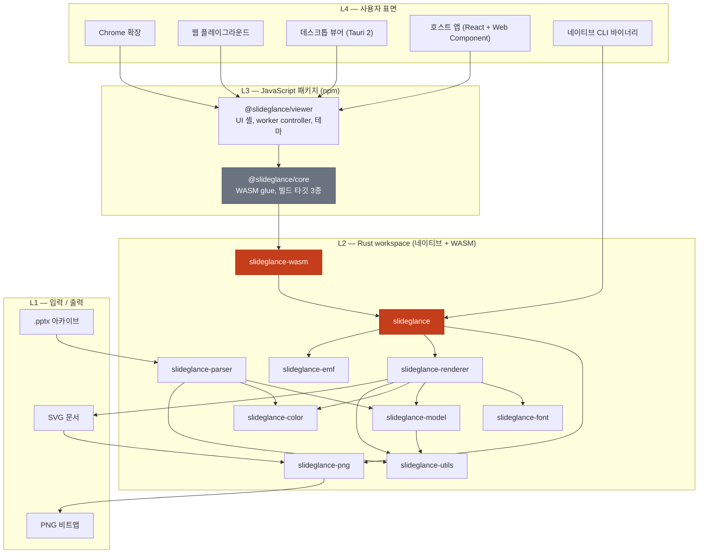
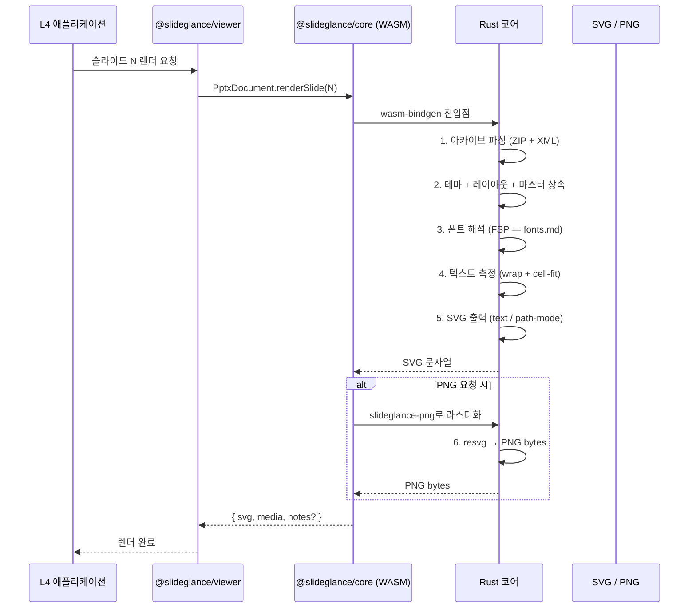
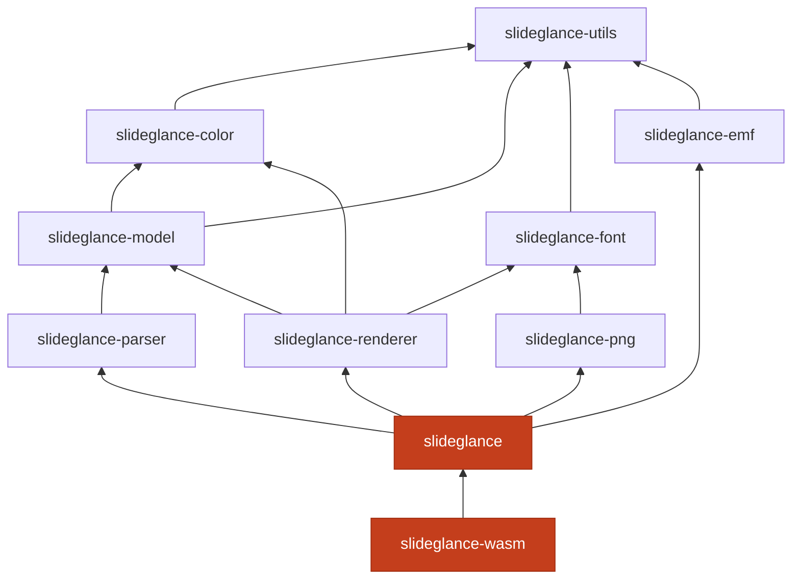
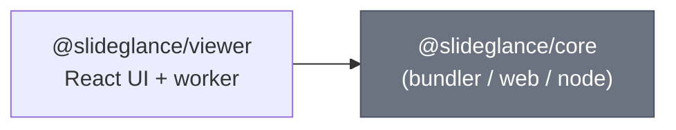
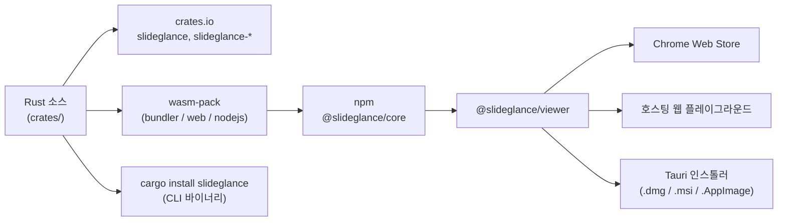
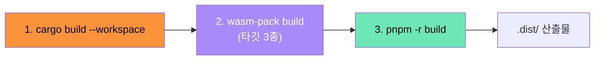

# SlideGlance 아키텍처

> English version: [`architecture.md`](architecture.md)

## 목차

1. [레이어 개요](#1--레이어-개요)
2. [변환 파이프라인](#2--변환-파이프라인)
3. [컴포넌트 책임](#3--컴포넌트-책임)
4. [배포 채널](#4--배포-채널)
5. [빌드 파이프라인](#5--빌드-파이프라인)
6. [결정성 보장](#6--결정성-보장)
7. [더 읽어볼 자료](#7--더-읽어볼-자료)

---

## 1 · 레이어 개요

Chrome 확장과 데스크톱 뷰어는 같은 JS 레이어를, CLI와
WASM 번들은 같은 Rust 코어를 공유한다.

| 레이어 | 언어 / 런타임                       | 맡은 일                                                                       |
| ------ | ----------------------------------- | ----------------------------------------------------------------------------- |
| L1     | I/O                                 | `.pptx` 아카이브와 SVG / PNG 출력.                                            |
| L2     | Rust → 네이티브 + WebAssembly       | 파싱, 레이아웃, 폰트 측정·셰이핑, SVG 출력, PNG 라스터화.                     |
| L3     | TypeScript / JavaScript             | UI 셸, worker, 테마, 프레임워크 어댑터. PPTX는 건드리지 않는다.               |
| L4     | 브라우저 / Tauri / 네이티브 바이너리 | 사용자 앱.                                                                    |

PPTX 해석은 모두 L2에서 끝난다. JS는 WASM 코어를 구동하고 SVG를 DOM에
붙이는 얇은 셸이다.

---

## 2 · 변환 파이프라인

`.pptx` → SVG (필요시 PNG) 6단계.

| 단계 | 모듈                             | 하는 일                                                                                              |
| ---- | -------------------------------- | ---------------------------------------------------------------------------------------------------- |
| 1    | `slideglance-parser`             | ZIP을 열어 슬라이드 / 레이아웃 / 마스터 / 테마 XML 파싱.                                             |
| 2    | `slideglance` (`doc`, `convert`) | 텍스트 스타일 상속, color-map override, placeholder 지오메트리 병합.                                |
| 3    | `slideglance-font`               | FSP 순회: 임베드 → 호출자 → 번들 → 호스트 OS → fallback.                                            |
| 4    | `slideglance-font` + `-renderer` | rustybuzz 글리프 셰이핑 + run 단위 wrap. 측정과 렌더에 같은 face 사용.                              |
| 5    | `slideglance-renderer`           | resolver 있으면 path-mode (`<path>` outline), 없으면 text-mode.                                     |
| 6    | `slideglance-png` (resvg)        | path-mode SVG → PNG. resvg가 시스템 폰트를 안 뒤지도록 path-mode 필수.                              |

---

## 3 · 컴포넌트 책임

### Rust workspace (L2)

의존성은 단방향. 하위 크레이트만 단독 사용해도 상위는 끌려오지 않는다.

| 크레이트                | 역할                                                                                |
| ---------------------- | ----------------------------------------------------------------------------------- |
| `slideglance-utils`    | `Emu` / `Pt` 단위 타입 — 단위 혼동을 컴파일 시점에 차단.                             |
| `slideglance-color`    | 테마 색 해석 + lumMod / tint 같은 색 변환.                                          |
| `slideglance-model`    | 도형 / 텍스트 / 채우기 / 표 / 차트 / 테마를 담는 중간 모델.                          |
| `slideglance-parser`   | ZIP + XML → 상속이 모두 풀린 `Presentation`.                                         |
| `slideglance-font`     | resolver chain, OpenType wrap measurer, CJK 분리, 테마 스크립트 폰트.                |
| `slideglance-renderer` | 모델 → SVG. text/path-mode, 효과, 와프, 표, 차트 모두 여기.                          |
| `slideglance-emf`      | EMF / WMF 안의 비트맵을 BMP / PNG로 추출해 인라인 가능하게.                          |
| `slideglance-png`      | resvg로 SVG → PNG. 시스템 폰트가 결과를 흔들지 않도록 항상 path-mode.                |
| `slideglance`          | 공개 API + CLI 바이너리.                                                            |
| `slideglance-wasm`     | 위 코어를 브라우저 / Node에서 쓸 수 있게 노출하는 wasm-bindgen 진입점.               |

### JavaScript 패키지 (L3)

- `@slideglance/core` — `dist/{bundler,web,node}/` 세 빌드. `package.json`
  `exports`가 환경별 빌드를 자동 선택.
- `@slideglance/viewer` — toolbar, thumbnails, notes, sections, search,
  theme, print, PDF export 포함 React 셸. Web Worker에서
  `@slideglance/core`를 구동하고 SVG만 메인 스레드로 보낸다. 번들이
  `<pptx-viewer>` Web Component까지 등록하므로 vanilla / 비-React
  호스트도 별도 어댑터 없이 마운트할 수 있다.

### 앱 (L4)

| 앱                 | 역할                                                                          |
| ------------------ | ----------------------------------------------------------------------------- |
| `chrome-extension` | `.pptx` URL을 가로채 뷰어 탭으로 보내는 service worker + 우클릭 메뉴.         |
| `web-playground`   | `.pptx` 드롭 시 렌더하는 Vite SPA. fixture·데모용.                            |
| `desktop-viewer`   | Tauri 2 셸 + `pptx://` URI, 네이티브 메뉴, 드래그-드롭, 최근 파일.            |

---

## 4 · 배포 채널

같은 Rust 코어가 다섯 채널로 배포된다.

결정적 SVG, MIT, 텔레메트리 없음 — 채널과 무관하게 동일.

---

## 5 · 빌드 파이프라인

세 단계 순차 의존. JS 패키지의 `prebuild` hook이 wasm 빌드를 자동
실행하며, 변경이 없으면 즉시 종료한다.

| 단계 | 드라이버                            | 산출물                                                                |
| ---- | ----------------------------------- | --------------------------------------------------------------------- |
| 1    | `cargo build --workspace`           | `target/{debug,release}/`의 라이브러리와 CLI 바이너리.                 |
| 2    | `scripts/build-wasm.sh` (wasm-pack) | `packages/core/dist/{bundler,web,node}/`의 wasm + JS glue.            |
| 3    | `pnpm -r build`                     | JS 패키지 `dist/`, 플레이그라운드 번들, 확장 zip, Tauri 앱.            |

wasm 빌드는 mtime 기반 캐시. 변경 없으면 100ms 내 종료, 강제 재빌드는
`FORCE=1`.

---

## 6 · 결정성 보장

- **SVG 결정적** — 같은 입력 + 같은 옵션 → 바이트 단위 동일.
- **PNG 결정적** — 같은 폰트 셋이 주어졌을 때. VRT가 이를 이용해 변동을
  검출.
- **시스템 시계 미사용** — `datetime{N}`은 `Timestamp` 없으면 placeholder
  유지.
- **렌더 경로 무작위성 없음** — `BTreeMap` / 정렬 키로 순서 고정.
- **`unsafe` 금지** (`unsafe_code = "forbid"`).

---

## 7 · 더 읽어볼 자료

- [`docs/fonts.md`](fonts.md) / [`fonts.ko.md`](fonts.ko.md) — 폰트
  파이프라인 레퍼런스.
- [`testing/vrt/snapshot/README.md`](../testing/vrt/snapshot/README.md)
  — 시각 회귀 suite.
- [`packages/viewer/README.md`](../packages/viewer/README.md) — 뷰어
  컴포넌트 API.
- [`apps/chrome-extension/README.md`](../apps/chrome-extension/README.md)
  — Chrome 확장 진입 흐름.
