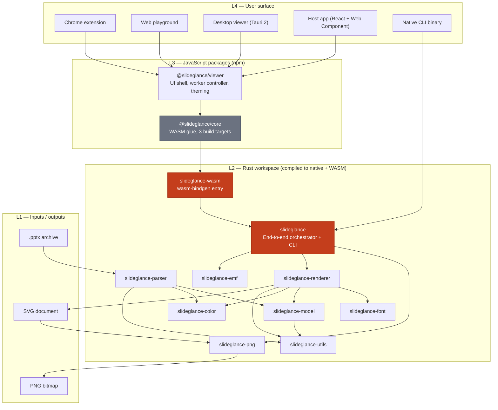
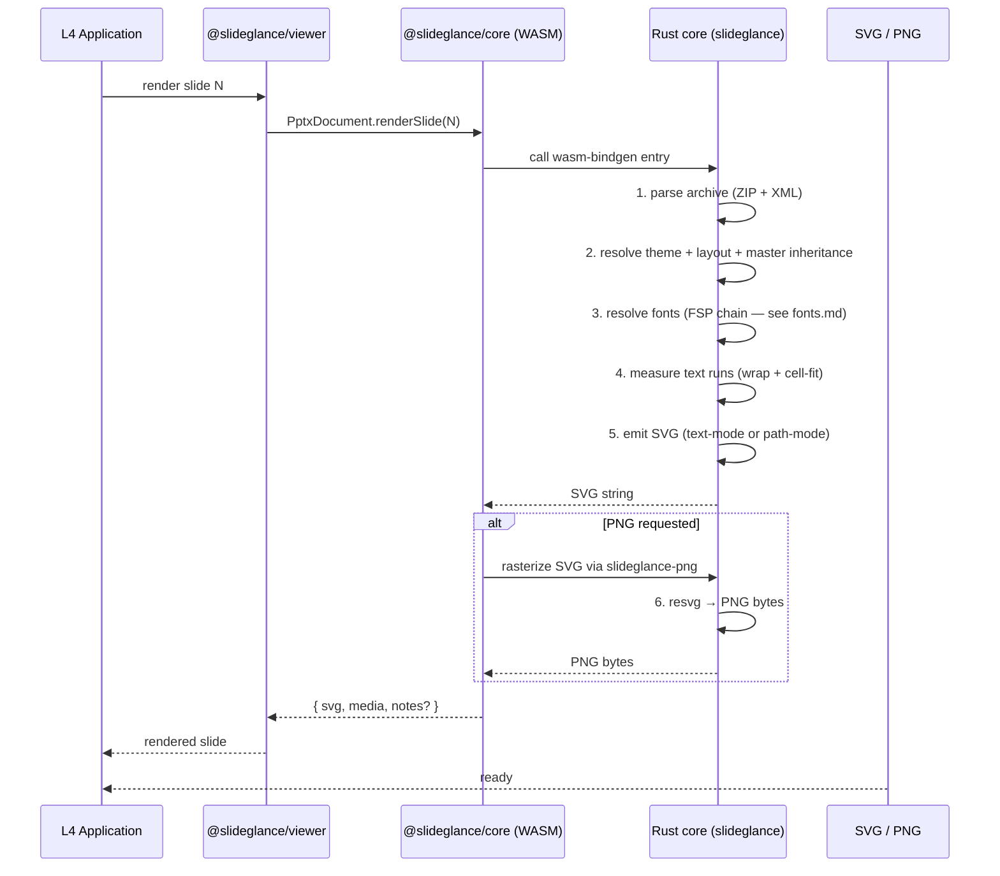
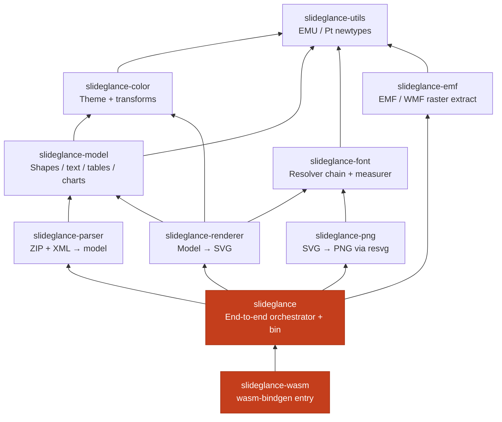
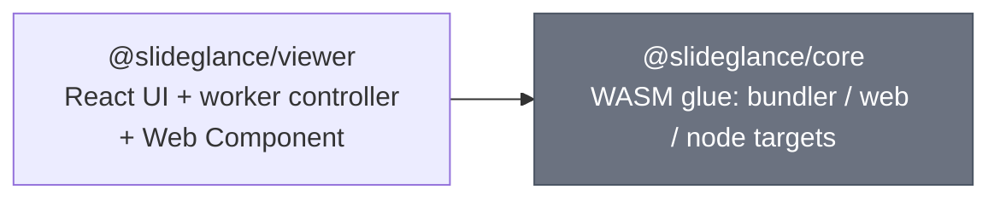
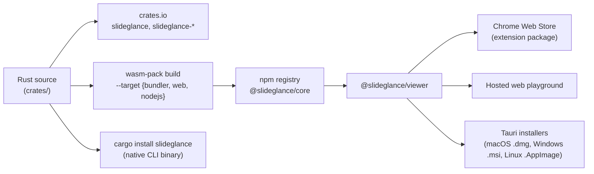
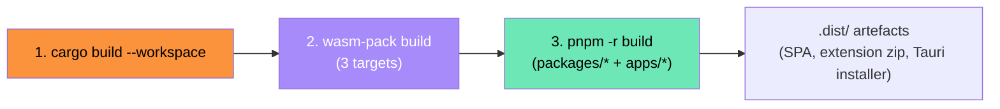

# SlideGlance Architecture

> Korean translation: [`architecture.ko.md`](architecture.ko.md)

## Table of contents

1. [Layered overview](#layered-overview)
2. [Conversion pipeline](#conversion-pipeline)
3. [Component responsibilities](#component-responsibilities)
4. [Distribution surfaces](#distribution-surfaces)
5. [Build pipeline](#build-pipeline)
6. [Determinism guarantees](#determinism-guarantees)
7. [Where to read next](#where-to-read-next)

---

## Layered overview

Four layers. The Chrome extension and desktop viewer share the same JS
layer; the CLI and WASM bundle share the same Rust core.

| Layer | Language / runtime                | Responsibility                                                                              |
| ----- | --------------------------------- | ------------------------------------------------------------------------------------------- |
| L1    | I/O                               | The `.pptx` archive and SVG / PNG output.                                                   |
| L2    | Rust → native + WebAssembly       | Parsing, layout, font measurement, glyph shaping, SVG emission, PNG rasterization.          |
| L3    | TypeScript / JavaScript           | UI shell, worker, theming, framework adapters. Does **not** parse PPTX.                     |
| L4    | Browser / Tauri / native binary   | The user-facing app.                                                                        |

All PPTX semantics live in L2. The JS layer is a thin shell that drives
the WASM core and renders SVG into the DOM.

---

## Conversion pipeline

`.pptx` → SVG (and optionally PNG) in six stages.

| Stage | Module                           | What happens                                                                                          |
| ----- | -------------------------------- | ----------------------------------------------------------------------------------------------------- |
| 1     | `slideglance-parser`             | Open ZIP, parse `presentation.xml`, slide XMLs, layouts, masters, theme.                              |
| 2     | `slideglance` (`doc`, `convert`) | Apply text-style inheritance, color-map override, placeholder geometry merging.                       |
| 3     | `slideglance-font`               | Walk the **font source priority** chain: embedded → caller-supplied → bundled → host OS → fallback.   |
| 4     | `slideglance-font` + `-renderer` | Glyph shaping (rustybuzz) + run-level wrap + cell-fit; same face used to measure and to render.       |
| 5     | `slideglance-renderer`           | Emit SVG. Path-mode (`<path>` glyph outlines) when a font resolver is supplied; text-mode otherwise.  |
| 6     | `slideglance-png` (resvg)        | Rasterize SVG to PNG. Requires path-mode SVG so resvg never has to perform host-system font matching. |

---

## Component responsibilities

### Rust workspace (L2)

Strict one-way dependency hierarchy. You can pull `slideglance-color` (or
any lower crate) without dragging in the renderer.

| Crate                  | Role                                                                                            |
| ---------------------- | ----------------------------------------------------------------------------------------------- |
| `slideglance-utils`    | Branded units (`Emu`, `Pt`, `HundredthPt`) so unit slips fail at compile time.                  |
| `slideglance-color`    | Theme color resolution (`<a:schemeClr>`, `<a:srgbClr>`) + color transforms (lumMod / tint / …). |
| `slideglance-model`    | Intermediate document model — shapes, text bodies, fills, gradients, tables, charts, themes.   |
| `slideglance-parser`   | ZIP + XML reader. Output: a fully-resolved `Presentation` with slide / layout / master merged.  |
| `slideglance-font`     | Font resolver chain, OpenType-based wrap measurer, CJK script splitting, theme-script fonts.    |
| `slideglance-renderer` | Model → SVG. Implements text-mode and path-mode emission, fills, effects, warps, tables, charts.|
| `slideglance-emf`      | Detects EMF / WMF raster wraps, extracts the inner BMP / PNG so they can be inlined as images.  |
| `slideglance-png`      | SVG → PNG via resvg. Always runs in path-mode so host-system fonts don't affect output.         |
| `slideglance`          | Public API (`convert_to_svg`, `convert_to_png`, `PptxDocument`) + CLI binary.                   |
| `slideglance-wasm`     | wasm-bindgen entry that re-exports the orchestrator for browser / Node consumers.               |

### JavaScript packages (L3)

- `@slideglance/core` — three builds in `packages/core/dist/{bundler,web,node}/`,
  selected by `package.json` `exports` per environment.
- `@slideglance/viewer` — React shell with toolbar, thumbnails, notes,
  sections, search, theme, print, PDF export. Drives `@slideglance/core`
  in a Web Worker and pipes SVG back to the main thread. The bundle
  also registers a `<pptx-viewer>` Web Component so vanilla / non-React
  hosts can mount the viewer without any framework adapter.

### Apps (L4)

| App                | Role                                                                                                |
| ------------------ | --------------------------------------------------------------------------------------------------- |
| `chrome-extension` | Service worker intercepts `.pptx` URLs and redirects to a viewer tab; right-click menu.             |
| `web-playground`   | Vite SPA — drop a `.pptx` to render. Used for fixtures and demos.                                   |
| `desktop-viewer`   | Tauri 2 shell + `pptx://` URI, native menubar, drag-drop, recent files.                             |

---

## Distribution surfaces

The same Rust core ships through five channels.

Deterministic SVG, MIT, no telemetry — uniform across every channel.

---

## Build pipeline

Three sequential stages. Each consuming package's `prebuild` hook runs
the wasm build, short-circuiting when `crates/` is unchanged.

| Stage | Driver                              | Output                                                                            |
| ----- | ----------------------------------- | --------------------------------------------------------------------------------- |
| 1     | `cargo build --workspace`           | Native libraries + the CLI binary in `target/{debug,release}/`.                   |
| 2     | `scripts/build-wasm.sh` (wasm-pack) | `packages/core/dist/{bundler,web,node}/slideglance_wasm_bg.wasm` + JS glue.       |
| 3     | `pnpm -r build`                     | Each JS package's `dist/`, the playground bundle, the extension zip, the Tauri app. |

The wasm script uses mtime-based caching — exits under 100 ms when up to
date. Set `FORCE=1` to override.

---

## Determinism guarantees

- **SVG deterministic** — same input + same options → byte-identical SVG.
- **PNG deterministic** — given the same font set. VRT relies on this to
  catch render drift.
- **No system clock** — `datetime{N}` placeholders stay literal unless
  the caller supplies a `Timestamp`.
- **No randomness** in render paths — `BTreeMap` / sorted keys lock
  iteration order.
- **No `unsafe`** (`unsafe_code = "forbid"`).

---

## Where to read next

- [`docs/fonts.md`](fonts.md) — font pipeline reference.
- [`docs/fonts.ko.md`](fonts.ko.md) — Korean translation.
- [`testing/vrt/snapshot/README.md`](../testing/vrt/snapshot/README.md)
  — visual regression suite.
- [`packages/viewer/README.md`](../packages/viewer/README.md) — viewer
  component API.
- [`apps/chrome-extension/README.md`](../apps/chrome-extension/README.md)
  — Chrome extension entry flows.
