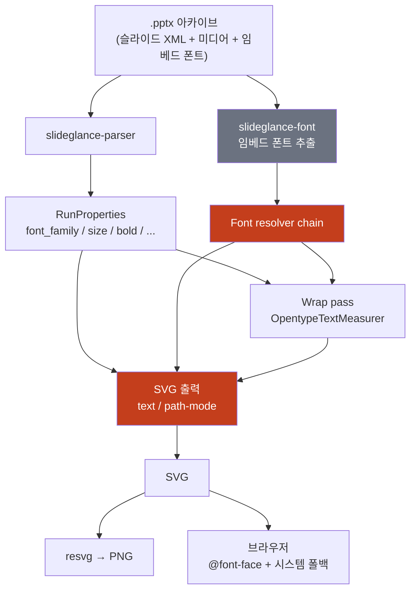
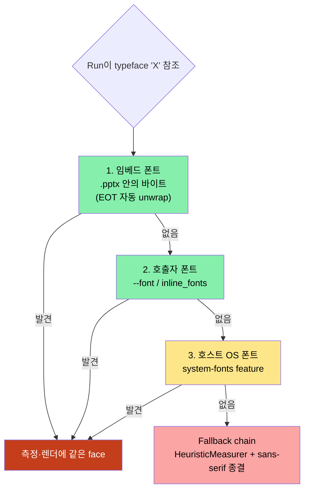
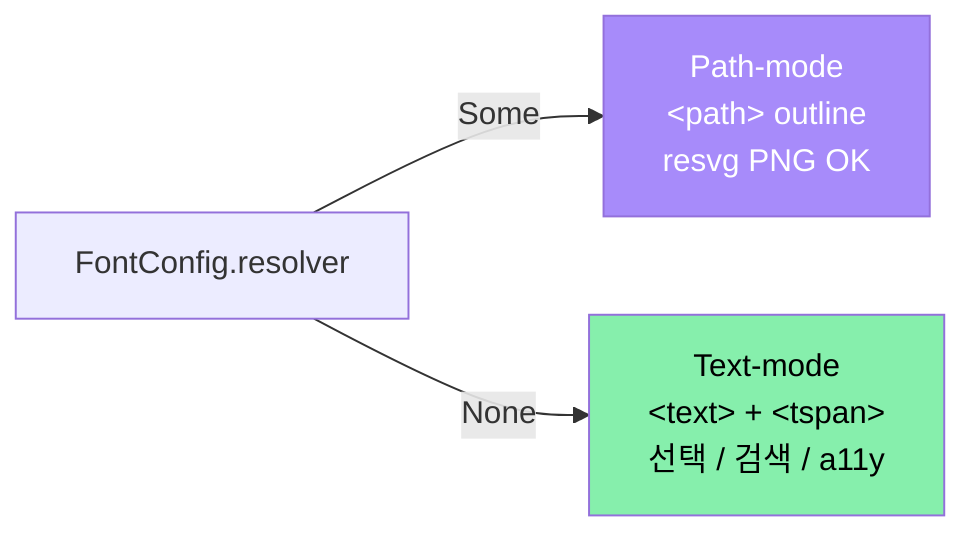
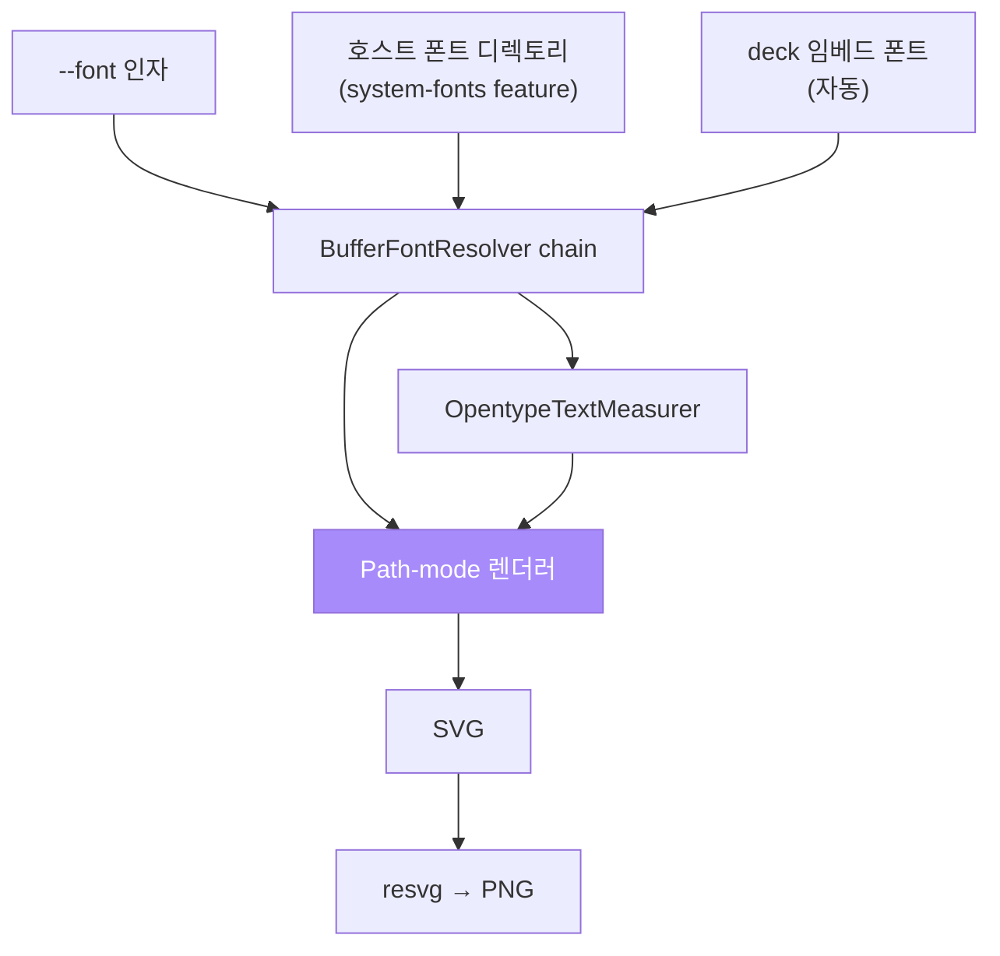
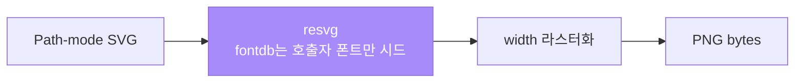
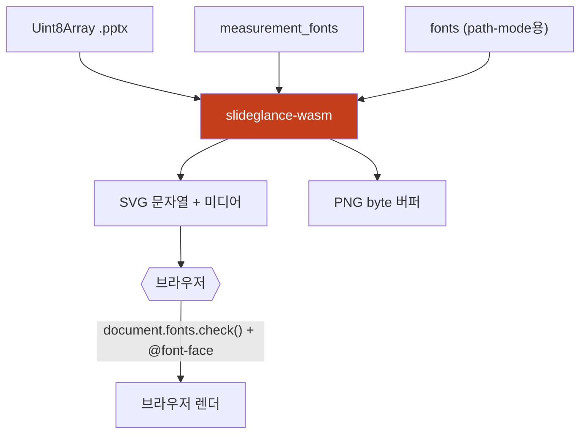
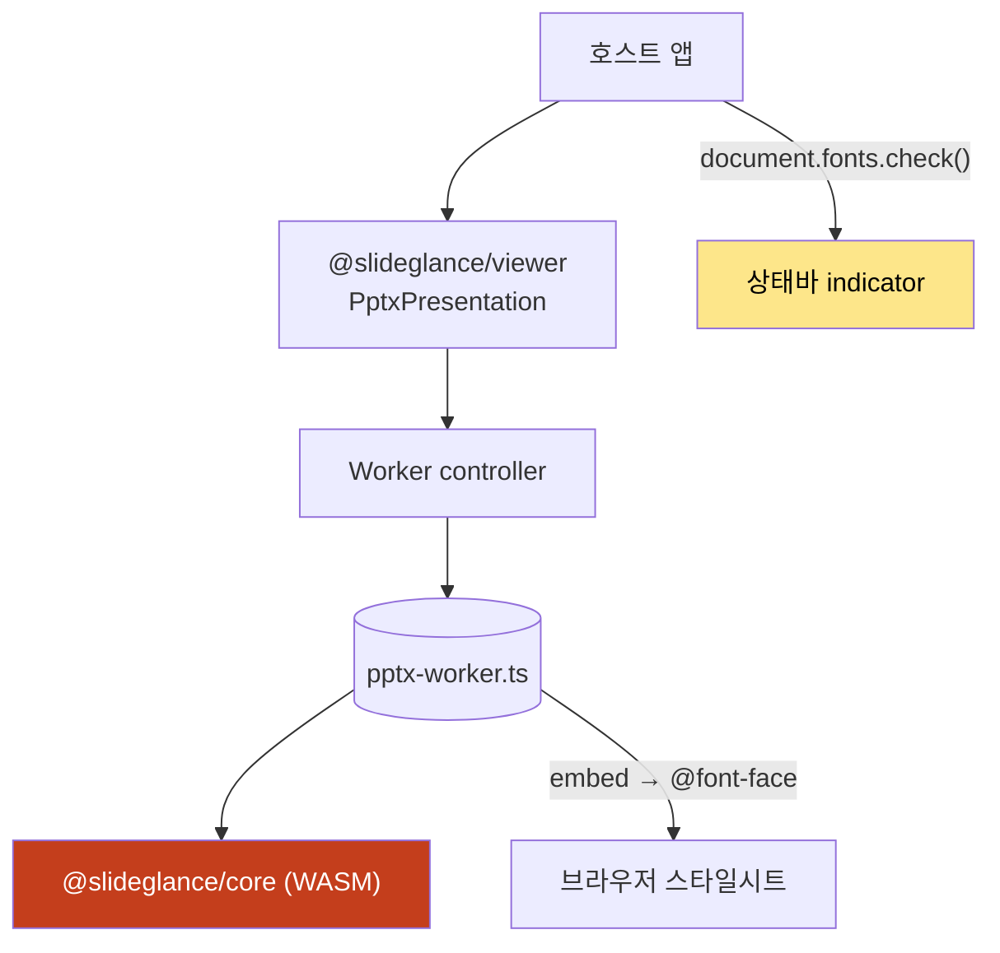
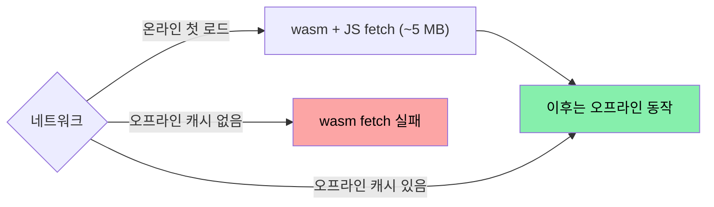

# SlideGlance 폰트 — 환경별 레퍼런스

> English version: [`fonts.md`](fonts.md)

다루는 환경:

1. **네이티브 CLI** — `slideglance convert / render`
2. **Rust 라이브러리** — `slideglance::convert_to_svg / convert_to_png`
3. **PNG 라스터화기** — 위 두 환경의 resvg 백엔드
4. **wasm 번들** — 브라우저 / Node용 `@slideglance/core`
5. **임베드 뷰어** — Chrome 확장 / 플레이그라운드 / 데스크톱이 쓰는
   `@slideglance/viewer`

## 목차

1. [파이프라인 개요](#1--파이프라인-개요)
2. [폰트 소싱 우선순위 (FSP)](#2--폰트-소싱-우선순위-fsp)
3. [출력 모드 — path vs. text](#3--출력-모드--path-vs-text)
4. [환경별 동작](#4--환경별-동작)
5. [OS 차이](#5--os-차이)
6. [브라우저 차이](#6--브라우저-차이)
7. [온라인 vs. 오프라인](#7--온라인-vs-오프라인)
8. [실패 모드](#8--실패-모드)
9. [Cargo feature](#9--cargo-feature)
10. [빠른 결정 표](#10--빠른-결정-표)

---

## 1 · 파이프라인 개요



분기점은 둘.

- **Measurer 선택** — parse 시점. wrap 폭 계산 방식.
- **Resolver 존재 여부** — render 시점. text-mode / path-mode.

원칙: **측정 face와 렌더 face는 항상 같다.** 어긋나면 줄바꿈이 화면과
달라진다.

---

## 2 · 폰트 소싱 우선순위 (FSP)

typeface 이름을 만나면 세 소스를 순서대로 탐색. **먼저 발견되는 쪽이
이긴다**.



| 소스 | 항상 사용 가능?                                   | 비고                                                                                  |
| ---- | ------------------------------------------------- | ------------------------------------------------------------------------------------- |
| 1 — 임베드 | deck에 있을 때 항상                              | `<p:embeddedFontLst>`에서 자동 추출, EOT wrapper 자동 제거. subset이라도 deck 사용 글리프는 모두 포함. |
| 2 — 호출자 | 항상                                              | "이 폰트는 반드시 있다"를 보장하는 통로.                                              |
| 3 — 호스트 OS | opt-in (`system-fonts`) + 파일시스템 존재         | `~/Library/Fonts` 등 스캔. **WASM에서는 무동작** (파일시스템 없음).                   |
| Fallback chain | 항상                                          | 휴리스틱 측정 + `sans-serif`로 끝나는 CSS chain.                                      |

매치 소스는 뷰어 상태바의 **폰트 매핑 indicator**로 확인 가능.

---

## 3 · 출력 모드 — path vs. text

호출자가 font resolver를 넘겼는지로 분기한다.



| 항목                          | Path-mode                       | Text-mode                          |
| ----------------------------- | ------------------------------- | ---------------------------------- |
| 엘리먼트                      | 글리프마다 `<path>`              | `<text>` + `<tspan>`               |
| 선택 / 검색 / 접근성          | ✖                                | ✔                                  |
| 뷰어 간 픽셀 일치             | ✔                                | ⚠ 브라우저 폰트 매칭에 따라         |
| resvg PNG                     | ✔                                | ✖ (시스템 폴백 안 함)              |
| 파일 크기                     | 큼                               | 작음                               |
| 필수 입력                     | 폰트 바이트가 든 resolver        | 없음                               |

**글리프 stretch 안 함** — PowerPoint도 안 하기 때문. 셀 오버플로는
그대로 둔다.

---

## 4 · 환경별 동작

### 4.1 · 네이티브 CLI



표준 사용은 `--font path1.ttf --font path2.otf`. `system-fonts` feature는
개발 편의용이고, 머신 간 재현성이 필요하면 `--font`로 폰트 셋을 고정한다.
CLI 렌더는 항상 path-mode.

### 4.2 · Rust 라이브러리

CLI와 같은 파이프라인을 코드로 호출.

```rust
use slideglance::{convert_to_png, ConvertOptions, FontConfig, AdditionalFont};

let opts = ConvertOptions {
    fonts: FontConfig {
        inline_fonts: vec![
            AdditionalFont::regular("Pretendard",
                std::fs::read("Pretendard-Regular.otf")?),
        ],
        ..Default::default()
    },
    ..Default::default()
};
let pngs = convert_to_png(std::fs::read("deck.pptx")?, &opts)?;
```

`FontConfig.resolver`가 path-mode 토글. `inline_fonts`를 채우면 resolver가
자동 생성된다.

### 4.3 · PNG 라스터화기

`slideglance-png`는 resvg를 결정적 옵션으로 감싼 모듈.



- **Text-mode SVG는 라스터화 불가** — resvg가 의도적으로 시스템 폰트
  폴백을 하지 않습니다 (결정성 목표). 글리프 자리가 빈 박스로 남습니다.
- fontdb는 `inline_fonts` / `--font`로만 채워집니다. parser 단에
  `system-fonts`가 켜져 있어도 라스터화기는 절대로
  `~/Library/Fonts`를 읽지 않습니다.

### 4.4 · wasm 번들

`packages/core/dist/{bundler,web,node}/` 세 빌드. Node·브라우저 동일 동작.



- **소스 4(호스트 OS) 무동작** — wasm 샌드박스에 파일시스템 없음.
- 1·2·3은 네이티브와 동일. 임베드 폰트는 생성자의 `measurement_fonts`로,
  path-mode 폰트는 `convert_to_png(fonts: …)`로 넘긴다.
- 기본 text-mode. `convertPptxToPng` 호출 시 path-mode (폰트 셋 필수).

### 4.5 · 임베드 뷰어

`@slideglance/core` 위에 React 셸과 Web Worker.



- 무거운 작업을 worker로 격리 — 수백 장 deck도 메인 스레드 응답성 유지.
- 임베드 폰트는 worker가 base64로 인코딩해 `@font-face`로 1회 마운트.
  이후 모든 `<text>`가 자동 사용.
- 폰트 매핑 indicator는 `document.fonts.check()`로 SVG의 font-family chain을
  검사해 매칭이 어긋난 항목만 표시. 완벽 매칭이면 미표시.
- `useCanvasMeasurer: true` 시 wrap 측정을 `OffscreenCanvas.measureText`로
  위임 — SVG 레이아웃과 실제 렌더 간 wrap 표류 제거.

---

## 5 · OS 차이

| OS       | CJK 자동 fallback                                                       | `system-fonts` 스캔 경로                                                |
| -------- | ----------------------------------------------------------------------- | ----------------------------------------------------------------------- |
| macOS    | Apple SD Gothic Neo (한), Hiragino Sans (일), PingFang SC (중)          | `~/Library/Fonts`, `/Library/Fonts`, `/System/Library/Fonts(/Supplemental)` |
| Windows  | 맑은 고딕 (한), Yu Gothic (일), Microsoft YaHei (중)                    | `C:\Windows\Fonts`, `%LOCALAPPDATA%\Microsoft\Windows\Fonts`            |
| Linux    | Noto Sans CJK (배포판마다 다름)                                          | `~/.fonts`, `~/.local/share/fonts`, `/usr/(local/)share/fonts`          |

CJK fallback chain은 SVG에 박혀 플랫폼 독립적이다. CJK 폰트가 하나라도
설치돼 있으면 어느 OS든 정상 렌더된다.

---

## 6 · 브라우저 차이

| 브라우저          | 동작                                                                                              |
| ----------------- | ------------------------------------------------------------------------------------------------- |
| Chromium / Edge   | 가장 잘 지원. `document.fonts.check()` 신뢰 가능, OffscreenCanvas 측정과 렌더 정확히 일치.        |
| Firefox           | 동일한 family detection. WOFF2 임베드 로딩이 약간 빠름.                                            |
| Safari            | < 16.4는 `font-size-adjust` 미지원 — 직접 font-size 스케일링으로 폴백.                            |
| WebView (Tauri)   | 호스트의 WebKit / WebView2 동작 그대로. 자체 미디어 프로토콜로 `Blob` URL 폐기 우회.              |

임베드 폰트 data URI는 네 환경 모두 동일 동작.

---

## 7 · 온라인 vs. 오프라인



네트워크는 **첫 로드에만 필요**. 폰트 CDN 의존 없음 — 번들 폰트는
바이너리에, 임베드 폰트는 .pptx에, 호출자 폰트는 호스트 번들에 포함된다.
Chrome 확장은 wasm·폰트가 확장 패키지에 묶여 처음부터 오프라인.

---

## 8 · 실패 모드

| 증상                                                                | 원인                                                          | 해결                                                                                  |
| ------------------------------------------------------------------- | ------------------------------------------------------------- | ------------------------------------------------------------------------------------- |
| CLI PNG에서 한국어 / CJK가 박스(□□□)                              | 소스 4 꺼짐, CJK `--font` 누락                                 | `--font /path/to/AppleSDGothicNeo.ttc` (face마다 반복).                               |
| wasm PNG에서 CJK가 라틴 대체 문자                                   | `convertPptxToPng`이 빈 `fonts`로 호출됨                      | `fonts`에 deck 폰트 버퍼 전달, 또는 SVG 출력 후 브라우저에서 처리.                    |
| 상태바에 "맑은 고딕 → Noto Sans KR" 같은 경고                       | deck의 CJK 폰트가 사용자 머신에 없음                           | 원본 폰트 설치, 또는 substitute 그대로 사용.                                          |
| SVG와 브라우저 렌더 간 wrap 위치가 다름                             | 측정 face와 렌더 face가 다름                                   | worker `useCanvasMeasurer: true` 또는 측정용 폰트 셋 명시.                            |
| `Failed to decode downloaded font: data:font/ttf;base64,...`      | EOT wrapper가 풀리지 않음                                      | 최신 SlideGlance로 업데이트 — EOT-strip extractor가 들어간 이후 해결됨.               |
| Tauri 앱이 슬라이드를 빈 패널로 표시                                | `pptx://` 프로토콜 핸들러 미등록                               | `tauri.conf.json` 확인 후 dev 서버 재시작.                                            |

---

## 9 · Cargo feature

| Feature                | 기본 | 추가되는 것                                                  |
| ---------------------- | ---- | ------------------------------------------------------------ |
| `system-fonts`         | off  | 소스 3 (호스트 파일시스템 스캔). 네이티브 전용.              |
| `metric-match`         | off  | PANOSE + OS/2 best-match 카탈로그 (라틴 80여 종).            |

배포 wasm 번들(`@slideglance/core`)은 `metric-match`로 빌드된다.

---

## 10 · 빠른 결정 표

### 입력으로 무엇을 넘겨야 하나?

| 목표                                       | 필요한 입력                                                      |
| ------------------------------------------ | ---------------------------------------------------------------- |
| 브라우저 뷰어 + 임베드 폰트 deck           | 없음.                                                            |
| 브라우저 뷰어 + 임베드 없는 CJK deck       | 사용자에 CJK 폰트 있으면 없어도 되고, 없으면 번들 폰트 추가.    |
| 서버 사이드 SVG                             | 참조 가능한 face마다 `inline_fonts`.                            |
| 서버 사이드 PNG                             | `inline_fonts` 필수 — 노출 글리프 모두 커버. resvg는 폴백 없음.|
| 머신 간 픽셀 일치                          | 매번 같은 `inline_fonts`, `system-fonts` feature 끔.            |

### 출력 모드는?

| 필요                       | 모드                                                                   |
| -------------------------- | ---------------------------------------------------------------------- |
| 텍스트 선택 / 검색         | Text-mode (기본).                                                      |
| 어디서나 같은 픽셀         | Path-mode SVG.                                                         |
| PNG 라스터화                | Path-mode SVG → `slideglance-png` (또는 `convertPptxToPng` 직접).      |
| 인쇄                        | Path-mode SVG → 뷰어의 PDF export.                                    |

---

문서와 실제 동작이 다르면 truth는 `crates/slideglance-font/`와
`packages/viewer/src/pptx-worker.ts`. 재현 deck을 첨부해 이슈로 보고하면
된다.
