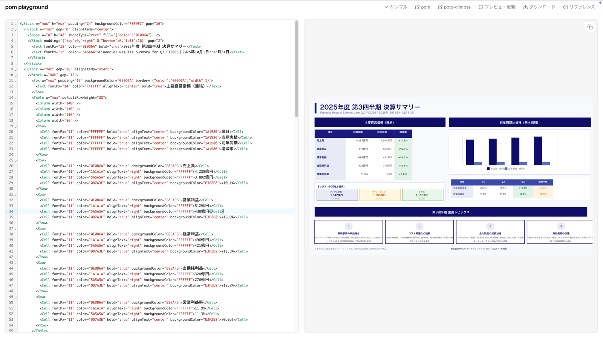

# @slideglance/builder

**`@slideglance/builder`** is a TypeScript library for declaratively describing PowerPoint presentations in XML and compiling them to editable `.pptx` files.

[Try in Playground →](/playground)



## Features

- **AI friendly** — A small XML vocabulary that LLMs can generate and edit reliably.
- **Declarative** — Describe slides as XML; no imperative pptxgenjs calls.
- **Flexbox layout** — `VStack` / `HStack` / `Layer` powered by [yoga-layout](https://yogalayout.dev/).
- **13 built-in nodes** — Text, lists, images, tables, shapes, charts, lines, icons, inline SVG, plus three containers.
- **Schema validated** — Runtime validation via Zod and a single compiled XML registry that drives both the parser and the generated XSD / JSON Schema.
- **PowerPoint native** — All shapes and styles map onto pptxgenjs primitives, so the output is a real editable PPTX.
- **Pixel units** — Pixel-based sizing throughout (converted to inches at 96 DPI internally).
- **Slide masters** — Define headers, footers, page numbers, and shared decoration once and apply to every slide.
- **Multi-file decks** — `<Import>` splits decks across files; `<Templates>` and `<Styles>` provide macro expansion and named style reuse.
- **Accurate text measurement** — Bundled `Noto Sans JP` and `Pretendard` measured via [`@slideglance/measure`](https://github.com/SlideGlance/slideglance) (WebAssembly OpenType) for layout that lines up with the rendered output.

## Quick Start

Requires Node.js 18 or later.

```bash
npm install @slideglance/builder
```

```typescript
import { buildPptx } from "@slideglance/builder";

const xml = `
<SlideGlance>
  <Document size="16:9" />
  <Slide>
    <VStack w="100%" h="max" padding="48" gap="24" alignItems="start">
      <Text fontSize="48" bold="true">Presentation Title</Text>
      <Text fontSize="24" color="666666">Subtitle</Text>
    </VStack>
  </Slide>
</SlideGlance>
`;

const { pptx } = await buildPptx(xml, { w: 1280, h: 720 });
await pptx.writeFile({ fileName: "presentation.pptx" });
```

## Node List

| Node   | Description                                                        |
| ------ | ------------------------------------------------------------------ |
| Text   | Text with rich inline formatting (B / I / U / S / Mark / Span / A) |
| Ul     | Bullet list with `<Li>` items                                      |
| Ol     | Numbered list with `<Li>` items + `numberType`                     |
| Image  | Images from path, URL, or `data:` URI; with sizing modes           |
| Table  | Columns + rows + cells, colspan/rowspan, per-cell decoration       |
| Shape  | 178 PowerPoint preset shapes with fill / line / text               |
| Chart  | Bar, line, pie, area, doughnut, radar                              |
| Line   | Straight line / arrow with absolute endpoints                      |
| Layer  | Absolute-positioned overlay container                              |
| VStack | Vertical Flexbox container                                         |
| HStack | Horizontal Flexbox container                                       |
| Icon   | Lucide icon catalogue, optional badge variants                     |
| Svg    | Inline `<svg>` rasterised to PNG                                   |

See [Nodes](./nodes.md) for the complete attribute reference. Composite-diagram styling (timelines, trees, flowcharts, matrices, pyramids, process arrows) is no longer a built-in node — compose it from `Layer` + `Shape` + `Line` + `Text`. The [`examples/builder-reference`](https://github.com/slideglance/builder/tree/main/examples/builder-reference) deck shows full diagram recipes built that way.

## Auto-Fit

When content exceeds the slide height, the builder automatically adjusts it to fit (enabled by default). See the [API Reference](./api-reference.md#autofit) for the adjustment priority and how to disable it.

## For AI Agent Developers

If you are building an AI agent that generates PPTX, include the contents of [`llm.txt`](/llm.txt) in your system prompt. It is a compact XML reference designed for LLMs.

## Links

- [GitHub](https://github.com/slideglance/builder)
- [npm](https://www.npmjs.com/package/@slideglance/builder)
- [Playground](/playground)
- [llm.txt](/llm.txt)
