# Nodes

This document is the complete reference for every XML tag that `@slideglance/builder` understands.

> **Note**: Slide transitions and slide-level animations are intentionally out of scope. The builder focuses on static visual layout and content for programmatic PPTX generation.

## Quick Reference

Minimal hello world:

```xml
<SlideGlance>
  <Document size="16:9" />
  <Slide>
    <VStack padding="40" gap="16">
      <Text fontSize="32" bold="true">Hello, builder</Text>
      <Text fontSize="18" color="666666">A declarative way to author PowerPoint slides.</Text>
    </VStack>
  </Slide>
</SlideGlance>
```

All available tags:

| Category             | Tags                                                                                                                                           |
| -------------------- | ---------------------------------------------------------------------------------------------------------------------------------------------- |
| Containers           | `<VStack>`, `<HStack>`, `<Layer>`                                                                                                              |
| Content              | `<Text>`, `<Ul>`/`<Ol>`/`<Li>`, `<Image>`, `<Table>` (`<Col>`, `<Tr>`, `<Td>`)                                                                 |
| Inline (within text) | `<B>`, `<I>`, `<U>`, `<S>`, `<Mark>`, `<Span>`, `<A>`                                                                                          |
| Graphics             | `<Shape>`, `<Line>`, `<Icon>`, `<Svg>`                                                                                                         |
| Diagrams             | `<Chart>`                                                                                                                                      |
| Meta / Composition   | `<SlideGlance>`, `<Slide>`, `<Master>`, `<Styles>`/`<Style>`, `<Templates>`/`<Template>`/`<Use>`/`<Slot>`, `<Import>`, `<Fragment>`, `<Notes>` |

See [Node List](#node-list) for detailed attribute references for each tag.

## Common Properties

Layout attributes that all nodes can have.

| Attribute         | Type                                                                       | Description                                                         |
| ----------------- | -------------------------------------------------------------------------- | ------------------------------------------------------------------- |
| `w`               | number / `"max"` / `"50%"`                                                 | Width                                                               |
| `h`               | number / `"max"` / `"50%"`                                                 | Height                                                              |
| `minW` `maxW`     | number                                                                     | Min/Max width                                                       |
| `minH` `maxH`     | number                                                                     | Min/Max height                                                      |
| `x` `y`           | number                                                                     | Absolute position used inside `<Layer>`                             |
| `padding`         | number / `padding.top="8" padding.bottom="8"`                              | Padding                                                             |
| `backgroundColor` | hex                                                                        | Background color (e.g., `F8F9FA`)                                   |
| `backgroundImage` | `backgroundImage.src="url" backgroundImage.sizing="cover"`                 | Background image                                                    |
| `border`          | `border.color="333" border.width="1"`                                      | Border                                                              |
| `borderRadius`    | number                                                                     | Corner radius (px)                                                  |
| `opacity`         | 0-1                                                                        | Background transparency                                             |
| `margin`          | number / `margin.top="8" margin.bottom="8"`                                | Outer margin                                                        |
| `zIndex`          | number                                                                     | Stacking order (higher = on top)                                    |
| `position`        | `relative` / `absolute`                                                    | Positioning mode                                                    |
| `top`             | number                                                                     | Top offset (with position)                                          |
| `right`           | number                                                                     | Right offset (with position)                                        |
| `bottom`          | number                                                                     | Bottom offset (with position)                                       |
| `left`            | number                                                                     | Left offset (with position)                                         |
| `alignSelf`       | `auto` / `start` / `center` / `end` / `stretch`                            | Override parent alignItems                                          |
| `shadow`          | `shadow.type="outer" shadow.blur="4" shadow.offset="2" shadow.color="000"` | Drop shadow (not supported on Line)                                 |
| `master`          | string                                                                     | Slide master name for this page root                                |
| `class`           | string                                                                     | Space-separated reusable style names                                |
| `isDecorative`    | `"true"`                                                                   | Marks element as decorative; sets altText to `""` for accessibility |

- `backgroundImage`: `src` accepts a URL or local file path. `sizing` controls how the image fits: `"cover"` (default) fills the area, `"contain"` fits within the area.
- `border`: Can be combined with `color`, `width`, and `dashType` (`"solid"` / `"dash"` / `"dashDot"` / `"lgDash"` / `"lgDashDot"` / `"lgDashDotDot"` / `"sysDash"` / `"sysDot"`).
- `opacity`: 0 = fully transparent, 1 = fully opaque. Useful for semi-transparent overlays with Layer nodes.
- Shorthand (`padding="16"` / `border='{"color":"333","width":1}'`) and dot notation (`padding.top="8"` / `border.color="FF0000"`) can be mixed on the same node. Shorthand is used as the default value, then dot notation overrides each top-level key.
- Mixed shorthand + dot notation is supported for: `padding` `margin` `border` `cellBorder` `line` `fill` `shadow` `underline` `beginArrow` `endArrow` `backgroundImage` `connectorStyle` `sizing`.
- `master` is only meaningful on root-level slide nodes inside a `<SlideGlance>` document.
- `class` can be used when you define reusable styles via `<Styles><Style ... /></Styles>` at the root or under `<SlideGlance>`.
- **Color format limitation**: All colors are 6-digit hex (no `#` prefix). PPTX theme colors (`accent1`–`accent6`, `dk1`/`dk2`/`lt1`/`lt2`, `hlink`, `folHlink`) are not supported.

### Dot Notation Properties

Composite properties (objects with multiple facets) accept two notations:

- **Shorthand** (single string): `padding="16"` (uniform), `padding="16 24"` (vertical horizontal), `padding="8 12 16 12"` (top right bottom left).
- **Dot notation** (per-facet): `padding.top="8" padding.bottom="16"`.
- **Mixed** (shorthand applied first, dot facets override): `padding="16" padding.top="24"`.

Properties supporting dot notation:

| Property                 | Facets                                                                                         |
| ------------------------ | ---------------------------------------------------------------------------------------------- |
| `padding`, `margin`      | `top`, `right`, `bottom`, `left`                                                               |
| `border`, `cellBorder`   | `color`, `width`, `dashType`, plus `top.*`/`bottom.*`/`left.*`/`right.*` for per-side override |
| `line` (Shape stroke)    | `color`, `width`, `dashType`                                                                   |
| `fill` (Shape)           | `color`, `transparency`                                                                        |
| `shadow`                 | `type` (`outer`/`inner`), `color`, `blur`, `offset`, `angle`, `transparency`                   |
| `underline`              | `color`, `style`                                                                               |
| `beginArrow`, `endArrow` | `type`, `size`                                                                                 |
| `backgroundImage`        | `src`, `sizing`                                                                                |
| `sizing` (Image)         | `type` (`contain`/`cover`/`crop`), `w`, `h`, `x`, `y` (varies by type)                         |

Example combining both notations:

```xml
<VStack padding="16" padding.top="32" border.color="DDDDDD" border.width="1">
  <Text>Wider top padding, uniform 16 elsewhere.</Text>
</VStack>
```

## Named Resources

The builder provides three patterns for declaring named, reusable resources and referencing them by name. Each follows the **declare-then-reference** pattern but uses a different reference attribute.

| Pattern      | Declaration                                                   | Reference                    | Scope                           |
| ------------ | ------------------------------------------------------------- | ---------------------------- | ------------------------------- |
| **Style**    | `<Styles><Style name="th">...</Style></Styles>`               | `class="th"` on any node     | Property bundle reuse           |
| **Template** | `<Templates><Template name="card">...</Template></Templates>` | `<Use template="card" />`    | Multi-element macro expansion   |
| **Master**   | `<Master name="CORP">...</Master>`                            | `master="CORP"` on `<Slide>` | Slide background and decoration |

> **Warning**: `master="..."` references on `<Slide>` are not validated at parse time. A typo (e.g., `master="primary"` when the master is named `"PRIMARY"`) silently falls back to the default master. Verify master names manually until parse-time validation is added.

Detailed semantics for each:

- Styles: see [Reusable Styles](#reusable-styles) below.
- Templates: see [Templates](#templates) below.
- Masters: see [Slide Master](master-slide.md).

## Reusable Styles

Use `<Styles>` to define reusable attribute presets and reference them with `class="..."`.

```xml
<Styles>
  <Style
    name="th"
    fontSize="11"
    color="FFFFFF"
    bold="true"
    textAlign="center"
    backgroundColor="1A1980"
  />
  <Style name="page" padding="48" backgroundColor="F8FAFC" />
</Styles>

<Table>
  <Tr>
    <Td class="th">Item</Td>
    <Td class="th">Current</Td>
  </Tr>
</Table>

<VStack class="page">
  <Text>Hello</Text>
</VStack>
```

- Multiple classes are allowed: `class="base accent"`
- Later classes override earlier classes
- Inline node attributes always override class-applied attributes

## Import

Use `<Import src="path.sgx" />` to split a document across multiple files. The imported file is loaded synchronously at parse time and its contents are inlined where the `<Import>` element sits.

```xml
<SlideGlance>
  <Document size="16:9" />
  <Import src="./_styles.xml" />
  <Import src="./_templates.xml" />

  <Slide>
    <VStack class="page">
      <Text class="title">Quarterly report</Text>
      <Import src="./_topic-cards.xml" />
    </VStack>
  </Slide>
</SlideGlance>
```

### File format

Each imported file must be a well-formed XML document with a single root element:

- `<Fragment>...</Fragment>` — generic wrapper for pieces meant to be inlined.
- `<SlideGlance>...</SlideGlance>` — accepted when the file is also runnable as a standalone document. Children are inlined; root attributes are ignored (only the importing root document controls slide size, masters, etc).

```xml
<!-- _styles.xml -->
<Fragment>
  <Styles>
    <Style name="page" padding="48" />
  </Styles>
</Fragment>
```

```xml
<!-- _slide-summary.xml -->
<Fragment>
  <Slide>
    <VStack class="page"><Text>Summary</Text></VStack>
  </Slide>
</Fragment>
```

Any other root element (or multiple top-level elements) is rejected with a parse error.

### Placement

`<Import>` is valid **anywhere** in the tree — at the `<SlideGlance>` root, inside a `<Slide>`, inside a container like `<VStack>`/`<HStack>`, etc. The imported file's children are spliced in place of the `<Import>` element.

### Resolver

Imports require a caller-supplied resolver passed through `buildPptx` options:

```ts
import { buildPptx } from "@slideglance/builder";
import * as fs from "fs";
import * as path from "path";

const allowedBaseDir = path.resolve("./slides");
const allowedBase = fs.realpathSync(allowedBaseDir);

const documentPath = path.resolve(allowedBaseDir, "main.sgx");
await buildPptx(
  fs.readFileSync(documentPath, "utf8"),
  { w: 1280, h: 720 },
  {
    sourcePath: documentPath,
    resolveImport: (src, fromPath) => {
      const baseDir = fromPath ? path.dirname(fromPath) : process.cwd();
      const candidate = path.resolve(baseDir, src);
      // 1. Normalize symbolic links and case-insensitive paths
      const absolute = fs.realpathSync(candidate);
      // 2. Confine to allowed base directory (path traversal prevention)
      if (!absolute.startsWith(allowedBase + path.sep)) {
        throw new Error(`Import outside allowed directory: ${src}`);
      }
      return { content: fs.readFileSync(absolute, "utf8"), path: absolute };
    },
  },
);
```

The resolver returns both the file `content` and its absolute `path`; the absolute `path` (after `realpathSync` normalization) is used for cycle detection.

> **Security**: When processing untrusted XML, the resolver must enforce a base directory and reject paths that escape it (`../`). The example above demonstrates safe path normalization with `fs.realpathSync` and a `startsWith(allowedBase + path.sep)` boundary check. A naive `path.resolve(baseDir, src)` allows `<Import src="../../../etc/passwd"/>` to read arbitrary server files. Cycle detection also depends on path normalization — without `realpathSync`, two case-different paths or a symlink can bypass cycle detection on case-insensitive filesystems (e.g., macOS APFS).

### Notes

- Imports are expanded before `<Templates>` collection and `<Use>` expansion, so an imported file may contribute `<Styles>`, `<Templates>`, `<Master>`, `<Slide>`, or any content fragment.
- Nested imports work (imported files may themselves use `<Import>`). Recursion is bounded by a depth limit of **16**.
- Circular imports are detected by the absolute `path` returned by the resolver and reported as a parse error.
- `<Import>` used without supplying a resolver in `buildPptx` options produces a clear error at parse time.

## Templates

Use `<Templates>` at the `<SlideGlance>` root to define reusable XML fragments parameterized by `{name}` placeholders, then instantiate them with `<Use template="...">`. Templates are expanded at parse time, so they incur no runtime cost and produce the same output as writing the body inline.

```xml
<SlideGlance>
  <Templates>
    <Template name="topicCard" params="num,title,body">
      <VStack w="200" padding="12" backgroundColor="FFFFFF" border.color="0E0D6A" border.width="2">
        <VStack gap="6" alignItems="center">
          <Shape w="36" h="36" shapeType="ellipse" fill.color="E8EAF6" fontSize="12" color="0E0D6A">{num}</Shape>
          <Text fontSize="11" color="0E0D6A" bold="true" textAlign="center">{title}</Text>
          <Text fontSize="9" color="3C3C3C" textAlign="center">{body}</Text>
        </VStack>
      </VStack>
    </Template>
  </Templates>

  <Slide>
    <HStack padding="48" gap="12">
      <Use template="topicCard" num="01" title="신규 사업"
           body="AI 클라우드 42% 성장" />
      <Use template="topicCard" num="02" title="비용 최적화"
           body="판관비율 1.2%p 개선" />
    </HStack>
  </Slide>
</SlideGlance>
```

### Placeholder substitution

- `{name}` works in **any attribute value** and in text content. Layout attributes (`w`, `h`, `gap`, `alignItems`, `class`, `padding`, etc.) are substitutable too.
- Every `<Use>` attribute (except the reserved `template`) is exposed as a placeholder value with the same name. The `params="..."` declaration on `<Template>` is optional and informational.
- A `{name}` with no matching `<Use>` attribute produces a parse error.
- Use `{{name}}` (double braces) to output a literal `{name}` — escapes the placeholder syntax.

### Slots for long or structured content

Attributes hold strings only. For multi-element or paragraph-length content, use `<Slot name="X" />` in the template body and supply matching `<Slot name="X">…children…</Slot>` inside the `<Use>` call.

```xml
<Use template="topicCard" num="03" title="...">
  <Slot name="body">
    <Text>여러 단락으로 된 본문</Text>
    <Text>두 번째 줄</Text>
  </Slot>
</Use>
```

If the template's `<Slot>` element has its own children, those serve as the default content when no slot is supplied:

```xml
<Template name="card">
  <VStack>
    <Slot name="body"><Text>(no body)</Text></Slot>
  </VStack>
</Template>
```

A `<Slot name="X">{x}</Slot>` form (default = a single placeholder) is the idiomatic way to allow either an attribute (short) or a slot (long) to provide the same content.

### Notes

- Templates are global within the `<SlideGlance>` document. They are collected in a single pass before any expansion, so **forward references work** — a `<Template>` can `<Use>` another template defined later in the document or imported from another file.
- A template body may invoke another template via `<Use>`; expansion is recursive with a depth limit of 32 to catch circular references.
- The `<Slide>` node still requires exactly one root child after expansion — design templates so that each `<Use>` produces a single root element.

> **Note**: The `<Templates>` block must be a direct child of `<SlideGlance>` (or `<Fragment>` for imports). Nested `<Templates>` inside `<Slide>`, `<VStack>`, etc. will be silently ignored — define templates at the top level only.

> **Note**: The Import depth limit (16) is lower than Templates depth (32) because Import resolution involves I/O (file reads) and benefits from a more conservative cap.

### Conditionals & Iteration (`<If>`, `<Choose>`, `<Foreach>`)

MyBatis-style control-flow tags run in the same parse-time pass as `<Use>` and read the same scope. Use them to express "almost identical" content — timeline rows, optional ornaments, branch by tone — without copy-pasting markup.

```xml
<Templates>
  <Template name="timeline-row" params="label,tone,date,title,body,isLast">
    <HStack gap="14" alignItems="start" w="100%">
      <VStack w="60" alignItems="center" gap="6">
        <VStack class="bg-{tone}" w="36" h="36" borderRadius="999"
                alignItems="center" justifyContent="center">
          <Text color="FFFFFF" fontSize="13" bold="true" textAlign="center">{label}</Text>
        </VStack>
        <If test="!isLast">
          <VStack class="bg-hairline" w="2" h="48" />
        </If>
      </VStack>
      <VStack gap="2" w="max">
        <Choose>
          <When test="tone == 'coral'">
            <Text class="caption" color="AA2D00">{date}</Text>
          </When>
          <When test="tone == 'forest'">
            <Text class="caption" color="0A2E0E">{date}</Text>
          </When>
          <Otherwise>
            <Text class="caption" color="6B4A1A">{date}</Text>
          </Otherwise>
        </Choose>
        <Text class="title-sm">{title}</Text>
        <Text class="body-muted">{body}</Text>
      </VStack>
    </HStack>
  </Template>
</Templates>

<Foreach items='[
  {"label":"Q1","tone":"coral","date":"JANUARY 2026","title":"Coral surface launches.","body":"…"},
  {"label":"Q2","tone":"forest","date":"APRIL 2026","title":"Forest joins the demo grid.","body":"…"},
  {"label":"Q3","tone":"mustard","date":"JULY 2026","title":"Mustard ships.","body":"…"}
]' as="m" lastAs="isLast">
  <Use template="timeline-row"
       label="{m.label}" tone="{m.tone}"
       date="{m.date}" title="{m.title}" body="{m.body}"
       isLast="{isLast}" />
</Foreach>
```

#### `<If test="expr">…</If>`

Emits its body when `expr` is truthy. Falsy: `false`, `null`, `undefined`, `0`, `""`, empty array.

#### `<Choose>` / `<When test="expr">` / `<Otherwise>`

First-match branch. The body of the first `<When>` whose `test` is truthy is emitted. If none match and an `<Otherwise>` is present, its body is emitted instead. At most one `<Otherwise>` is allowed.

#### `<Foreach items="…" as="m" indexAs="i" firstAs="isFirst" lastAs="isLast">`

Repeats its body once per element of `items`. Required: `items` (JSON array, either inline or `"{ref}"` to a parent attribute) and `as` (the iteration variable). Optional: `indexAs`, `firstAs`, `lastAs` add the 0-based index and boundary flags into scope. Each iteration produces an independent subtree, so attribute mutations never leak between rows.

#### Expression grammar

Both `test=` and `items=` (after substitution) accept the same small expression language:

| Form                     | Example                                                   | Notes                                                      |
| ------------------------ | --------------------------------------------------------- | ---------------------------------------------------------- |
| Identifier / dotted path | `m`, `m.tone.shade`                                       | Walks objects; returns `undefined` past null/missing keys. |
| Literals                 | `"text"`, `'text'`, `42`, `3.14`, `true`, `false`, `null` | Strings support `\"`, `\'`, `\n`, `\t` escapes.            |
| Comparisons              | `==`, `!=`, `<`, `<=`, `>`, `>=`                          | `==`/`!=` coerce string↔number so `m.size == 40` works.    |
| Logical                  | `&&`, `\|\|`, `!`                                         | Short-circuits.                                            |
| Helpers                  | `empty(x)`, `not(x)`, `length(x)`                         | `empty` is true for null / undefined / `""` / `[]` / `{}`. |
| Parens                   | `(expr)`                                                  | Standard grouping.                                         |

Intentionally absent: arithmetic, regex, indexing (`[]`), string concatenation, ternary. If the data needs that level of computation it belongs in build-time TypeScript that emits the XML, not in the markup.

#### Placeholder paths

`{name}` and `{name.deep.path}` substitute scope values into attribute values and text content. Object/array values stringify to JSON; primitives use `String()`. **Object iteration variables don't survive crossing a `<Use>` boundary** — pass scalar fields explicitly (`title="{m.title}"` rather than `m="{m}"`).

#### Notes

- Directives compose: `<If>` inside `<Foreach>`, `<Foreach>` inside `<Use>` body, etc.
- A `<Use>` inside a `<Foreach>` body can fill its template's `<Slot>` children — Slot wrappers are preserved through the iteration so the inner `<Use>` sees them as slot fills, not as raw children.
- Top-level `<Foreach>` with inline JSON works (no template required).
- The `MAX_TEMPLATE_NODES` budget (default 100,000) caps total expanded output; runaway iteration aborts cleanly with a `TEMPLATE_EXPANSION_LIMIT` diagnostic.

#### Pitfalls when authoring `items='[…]'`

The `items` attribute is a single XML attribute value carrying a JSON literal. Three escaping rules trip up new authors:

1. **Apostrophes inside JSON strings.** Because the standard pattern uses single-quoted XML (`items='[…]'`), any literal `'` inside a JSON string would close the attribute early. Use the XML entity `&apos;` instead:

   ```xml
   <Foreach items='[
     {"desc":"Switches to the family&apos;s bold face."}
   ]' as="r"> … </Foreach>
   ```

2. **`{ident}` patterns inside JSON values.** Placeholder substitution runs over the `items` attribute _before_ JSON parsing, so a literal substring like `{gradient}` (a single identifier inside braces) is interpreted as a placeholder lookup against the outer scope and errors out. Escape with `{{ident}}` so the substituter emits the literal `{ident}`:

   ```xml
   <Foreach items='[
     {"desc":"{color, transparency} or {{gradient}}."}
   ]' as="r"> … </Foreach>
   ```

   Substrings that already contain a non-identifier character right after `{` (e.g. `{color, transparency}`, `{name?, labels[]}`, `{style:"sng"}`) do **not** match the placeholder regex, so they pass through unchanged.

3. **Standard XML entities inside JSON.** `<` and `&` must still be `&lt;` / `&amp;`; double quotes inside a JSON string need `\"`.

   ```xml
   <Foreach items='[
     {"attr":"&lt;Span&gt;","desc":"backgroundImage like {\"src\":\"…\"}."}
   ]' as="r"> … </Foreach>
   ```

#### Worked examples

Six recipes that cover the patterns you reach for in real decks. Each one is a complete fragment — drop it inside a `<Slide>` (or wrap with `<SlideGlance><Slide>…</Slide></SlideGlance>`) and it builds.

**1. Top-level `<Foreach>` over a string array**

The lightest possible use — no template, no scope plumbing. `as` binds the current string as `t`.

```xml
<VStack gap="4">
  <Foreach items='["alpha","beta","gamma"]' as="t">
    <Text class="body-ink">• {t}</Text>
  </Foreach>
</VStack>
```

**2. Iteration variables — `indexAs`, `firstAs`, `lastAs`**

Adding boundary flags lets the body know where it sits without recomputing them in every iteration. `<If test="!isLast">` is the typical use — drop a connector / divider between rows but skip it on the trailing one.

```xml
<Foreach items='[{"label":"Q1"},{"label":"Q2"},{"label":"Q3"}]'
         as="m" indexAs="i" firstAs="isFirst" lastAs="isLast">
  <HStack gap="8" alignItems="center">
    <Text class="kw-ink" w="20">{i}</Text>
    <Text class="body-ink">{m.label}</Text>
    <If test="!isLast">
      <Text class="caption" color="9297A0">→</Text>
    </If>
  </HStack>
</Foreach>
```

**3. `<If>` for optional ornaments**

Each `<If>` is independent — multiple `<If>` blocks at the same level are OR'd by inclusion (each one's body is emitted iff its `test` is truthy). Use this when 0+ branches may match. For exactly-one-of-N use `<Choose>`.

```xml
<VStack gap="4">
  <If test="status == 'ok'">    <Text class="chip-mint">OK</Text>    </If>
  <If test="status == 'warn'">  <Text class="chip-mustard">WARN</Text> </If>
  <If test="status == 'fail'">  <Text class="chip-coral">FAIL</Text> </If>
</VStack>
```

**4. `<Choose>` for exactly-one-of-N dispatch**

First-match semantics — exactly one of the bodies emits. The optional `<Otherwise>` is the default. Useful for tone-by-tone styling or "verb based on status" branches.

```xml
<Choose>
  <When test="m.tone == 'coral'">
    <Text class="chip-coral">{m.label}</Text>
  </When>
  <When test="m.tone == 'forest'">
    <Text class="chip-forest">{m.label}</Text>
  </When>
  <When test="m.tone == 'mustard'">
    <Text class="chip-mustard">{m.label}</Text>
  </When>
  <Otherwise>
    <Text class="chip-ink">{m.label}</Text>
  </Otherwise>
</Choose>
```

**5. Filtering rows with `<If>` inside `<Foreach>`**

`<Foreach>` enumerates everything in `items`, but you can keep individual iterations from emitting by gating the body on a per-item flag. The four input rows below produce three visible rows because Cleo's `active` is `false`.

```xml
<Foreach as="m" items='[
  {"name":"Alex","role":"Design","active":true},
  {"name":"Bao","role":"Engineering","active":true},
  {"name":"Cleo","role":"Marketing","active":false},
  {"name":"Devi","role":"Research","active":true}
]'>
  <If test="m.active">
    <HStack gap="10" alignItems="center" w="100%">
      <Text class="body-ink" w="80">{m.name}</Text>
      <Text class="body-muted">{m.role}</Text>
    </HStack>
  </If>
</Foreach>
```

**6. `<Foreach>` filling `<Use>` template slots**

When the per-iteration content is too rich to fit in `<Use>` attributes, fill the inner template's `<Slot>` children right inside the iteration body. The Slot wrapper is preserved through expansion so the inner `<Use>` sees them as slot fills, not raw children.

```xml
<Templates>
  <Template name="row">
    <HStack gap="14" alignItems="center" w="100%">
      <Slot name="left" />
      <Slot name="right" />
    </HStack>
  </Template>
</Templates>

<Foreach items='[
  {"l":"Brand voltage","r":"coral · forest · mustard · dark"},
  {"l":"Editorial type","r":"weight 400 · size + contrast"},
  {"l":"Section rhythm","r":"96px universal padding"}
]' as="r">
  <Use template="row">
    <Slot name="left">
      <Text class="kw-ink" w="160">{r.l}</Text>
    </Slot>
    <Slot name="right">
      <Text class="body-muted">{r.r}</Text>
    </Slot>
  </Use>
</Foreach>
```

#### When to reach for these

| Reach for                | When the markup is…                                                                                |
| ------------------------ | -------------------------------------------------------------------------------------------------- |
| `<Foreach>`              | …a list of 3+ near-identical Use calls that differ only in scalar attributes.                      |
| `<Foreach>` + `<If>`     | …a list whose membership is data-driven (active/featured/published flags).                         |
| `<Foreach>` + `<Choose>` | …a list where each row picks one of N styling variants (tone, status, severity).                   |
| `<If>` (standalone)      | …an optional ornament (connector, divider, badge) that only appears in some contexts.              |
| `<Choose>` (standalone)  | …a one-of-N dispatch on a single value (tone-by-tone style, status-driven copy).                   |
| Don't reach              | …data needs arithmetic, regex, or string concat — emit the XML from build-time TypeScript instead. |

The full deck recipe — `<Foreach>` + `<Choose>` + `<If>` building a roadmap with per-tone connectors and status chips — lives in `examples/builder-reference/chapters/16-control-flow.xml`.

### Multi-file Project Walkthrough

Real projects typically split presentations across multiple `.sgx` files: a root entry point, shared styles, reusable templates. Here is a minimal 3-file setup.

**`index.sgx`** (root):

```xml
<SlideGlance>
  <Document size="16:9" />
  <Import src="./_styles.xml" />
  <Import src="./_templates.xml" />
  <Slide>
    <Use template="titleSlide" title="Q4 Review" subtitle="2026" />
  </Slide>
  <Slide>
    <VStack class="page" gap="20">
      <Use template="sectionHeader" label="Highlights" />
      <Text class="body">Key results...</Text>
    </VStack>
  </Slide>
</SlideGlance>
```

**`_styles.xml`** (shared styles):

```xml
<Fragment>
  <Styles>
    <Style name="page" padding="48" />
    <Style name="body" fontSize="18" lineHeight="1.4" />
  </Styles>
</Fragment>
```

**`_templates.xml`** (shared templates):

```xml
<Fragment>
  <Templates>
    <Template name="titleSlide">
      <VStack padding="48" gap="12" alignItems="center" justifyContent="center">
        <Text fontSize="48" bold="true">{title}</Text>
        <Text fontSize="20" color="666666">{subtitle}</Text>
      </VStack>
    </Template>
    <Template name="sectionHeader">
      <Text fontSize="28" bold="true">{label}</Text>
    </Template>
  </Templates>
</Fragment>
```

### Presentation Size Aliases

The `<SlideGlance>
  <Document size="..." />` attribute accepts named size aliases in addition to `"16:9"` and `"4:3"`:

| Alias    | Width × Height (px) | Notes                        |
| -------- | ------------------- | ---------------------------- |
| `16:9`   | 1280 × 720          | Widescreen (default)         |
| `4:3`    | 1024 × 768          | Standard                     |
| `A4`     | 793 × 1122          | Portrait A4 at 96 DPI        |
| `A3`     | 1122 × 1587         | Portrait A3 at 96 DPI        |
| `Letter` | 816 × 1056          | US Letter portrait at 96 DPI |

For custom sizes, pass `w` and `h` directly to `buildPptx` instead of using a named alias.

### Processing Order

The parser walks the XML tree in three sequential passes before layout calculation:

1. **Import** — All `<Import src="...">` elements are resolved recursively (depth limit 16, cycle detection by absolute path). Imported `<Fragment>` or `<SlideGlance>` content is inlined at the import site.
2. **Templates** — All `<Templates>` blocks (across the root and imported files) are collected in a single pass into a flat registry. Then `<Use template="...">` calls are expanded, with placeholder substitution and `<Slot>` content insertion. Recursive expansion supports a depth limit of 32. Because collection precedes expansion, forward references and references across imported files both work correctly.
3. **Styles** — `<Styles>` blocks are collected, and `class="..."` references on any node (including those produced by `<Use>` expansion) apply the matching style's properties.

## Node List

The runtime registers exactly the nodes documented below. Composite diagram nodes (Timeline, Matrix, Tree, Flow, ProcessArrow, Pyramid) that earlier versions provided were removed in favour of composing the same patterns from `Layer` + `Shape` + `Line` + `Text`. The `examples/builder-reference` deck shows fully-worked recipes for sequence / hierarchy / flow / matrix / KPI patterns.

### 1. Text

A node for displaying text.

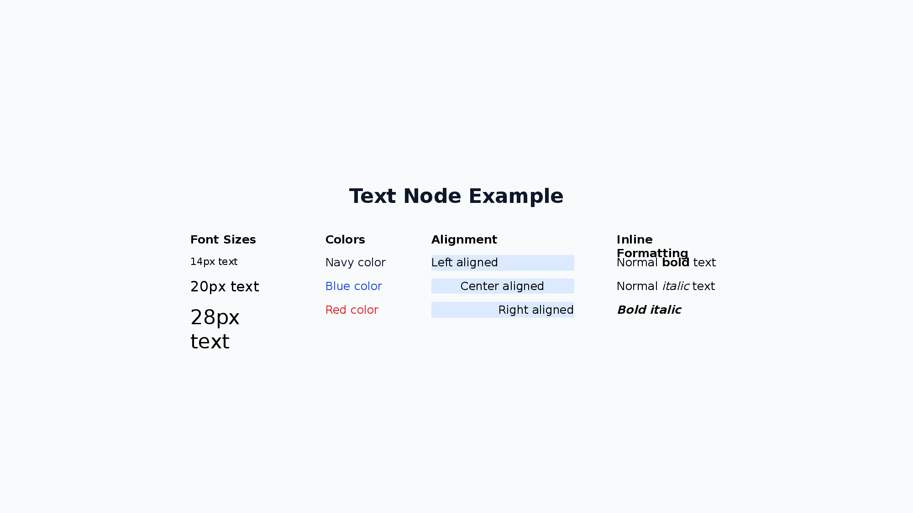

```xml
<Text fontSize="24" bold="true" color="333333" textAlign="center">Title</Text>
```

| Attribute                | Values                                                     |
| ------------------------ | ---------------------------------------------------------- |
| `fontSize`               | number (default: 24)                                       |
| `color`                  | hex (text color)                                           |
| `textAlign`              | `left` / `center` / `right`                                |
| `bold` `italic` `strike` | `true` / `false`                                           |
| `underline`              | `true` / `underline.style="wavy" underline.color="FF0000"` |
| `highlight`              | hex (highlight color)                                      |
| `fontFamily`             | string (default: `Noto Sans JP`)                           |
| `lineHeight`             | number (default: 1.0)                                      |

**Line breaks:**

Three options, each suited to a different situation:

- **Literal `\n` in body text** — decoded to a newline at parse time. Works for `<Text>`, `<Li>`, `<Td>`, `<Shape>`, `<Notes>`, and inside inline runs (`<B>`, `<Span>`, …). `\\n` stays as the literal two-char string `\n`. Other `\X` sequences (e.g. `C:\Users\foo`) are left untouched.

  ```xml
  <Text>line one\nline two</Text>
  ```

- **XML numeric entity `&#10;`** — same effect, but works inside attributes too (e.g. `text="line one&#10;line two"`). Useful when the text comes via the body-alias `text=` attribute. Attribute values are intentionally **not** `\n`-decoded so that JSON-bearing attributes like `items='[…]'` and `chartColors='[…]'` keep their own escape rules.

- **Multiple `<Text>` siblings** — the cleanest hard line break. Each `<Text>` is its own paragraph so `lineHeight`, `gap`, and per-line styling can vary.

  ```xml
  <VStack gap="0">
    <Text>line one</Text>
    <Text>line two</Text>
  </VStack>
  ```

There is no `<Br/>` element — inline formatting is limited to the seven tags below.

**Inline Formatting:**

Inline formatting tags within `<Text>`, `<Li>`, `<Td>`, and `<Shape>` text content:

| Tag                  | Effect                               | Example                                  |
| -------------------- | ------------------------------------ | ---------------------------------------- |
| `<B>`                | Bold                                 | `<B>important</B>`                       |
| `<I>`                | Italic                               | `<I>emphasized</I>`                      |
| `<U>`                | Underline                            | `<U>linked</U>`                          |
| `<S>`                | Strikethrough                        | `<S>removed</S>`                         |
| `<Mark color="...">` | Highlight (background color on text) | `<Mark color="FFFF00">key</Mark>`        |
| `<Span color="...">` | Text color (foreground)              | `<Span color="FF0000">alert</Span>`      |
| `<A href="...">`     | Hyperlink                            | `<A href="https://example.com">link</A>` |

> **Note**: `<Mark>` colors the **background** behind text; `<Span color>` changes the **text foreground** color. They are visually different.

Use `<B>`, `<I>`, `<A>`, `<U>`, `<S>`, `<Mark>`, and `<Span>` child elements for partial bold/italic/underline/strikethrough/highlight/color and hyperlinks within a single text node:

```xml
<Text fontSize="16">Normal <B>bold</B> and <I>italic</I> text</Text>
<Text fontSize="16"><B><I>Bold italic</I></B></Text>
<Text fontSize="16">Visit <A href="https://example.com">our site</A></Text>
<Text fontSize="16">Normal <U>underline</U> and <S>strikethrough</S> text</Text>
<Text fontSize="16"><Mark color="FFFF00">highlighted</Mark> text</Text>
<Text fontSize="16"><B><U>Bold underline nested</U></B></Text>
<Text fontSize="16">Normal <Span color="FF0000">red text</Span> normal</Text>
<Text fontSize="16"><B><Span color="1D4ED8">bold blue</Span></B></Text>
```

> **Security**: The builder does not validate `href` values on `<A>`. PPTX files generated with hyperlinks containing `javascript:`, `vbscript:`, or `file://` schemes can execute or expose data when opened in Office viewers. **Do not pass untrusted user input directly to `<A href>`.** Validate URLs against an allowlist of safe schemes (`https:`, `http:`, `mailto:`) before generating XML, or use the `allowedHrefSchemes` option in `buildPptx` to widen the default allowlist.

See [Styling Guide](./styling-guide.md#font-size-guide) for recommended font sizes.

**UnderlineStyle:**

`"dash"` | `"dashHeavy"` | `"dashLong"` | `"dashLongHeavy"` | `"dbl"` | `"dotDash"` | `"dotDotDash"` | `"dotted"` | `"dottedHeavy"` | `"heavy"` | `"none"` | `"sng"` | `"wavy"` | `"wavyDbl"` | `"wavyHeavy"`

### 2. Ul (Unordered List)

A node for displaying bullet-point lists. Use `<Li>` child elements to define list items.

```xml
<Ul fontSize="14" color="333333">
  <Li>Item A</Li>
  <Li>Item B</Li>
  <Li bold="true">Item C (bold)</Li>
</Ul>
```

**Ul Attributes:**

| Attribute                | Values                           |
| ------------------------ | -------------------------------- |
| `fontSize`               | number (default: 24)             |
| `color`                  | hex (text color)                 |
| `textAlign`              | `left` / `center` / `right`      |
| `bold` `italic` `strike` | `true` / `false`                 |
| `underline`              | `true` / underline options       |
| `highlight`              | hex (highlight color)            |
| `fontFamily`             | string (default: `Noto Sans JP`) |
| `lineHeight`             | number (default: 1.0)            |
| `bulletIndent`           | number in px (default: 19)       |

**Li Attributes (overrides parent Ul/Ol style):**

| Attribute                | Values                     |
| ------------------------ | -------------------------- |
| `fontSize`               | number                     |
| `color`                  | hex (text color)           |
| `bold` `italic` `strike` | `true` / `false`           |
| `underline`              | `true` / underline options |
| `highlight`              | hex (highlight color)      |
| `fontFamily`             | string                     |

Li also supports `<B>`, `<I>`, `<A>`, `<U>`, `<S>`, `<Mark>`, and `<Span>` inline formatting: `<Li>Normal <B>bold</B> item</Li>`, `<Li>See <A href="https://example.com">link</A></Li>`, `<Li><U>underline</U> item</Li>`, `<Li><Span color="FF0000">red</Span> item</Li>`

### 3. Ol (Ordered List)

A node for displaying numbered lists. Has all Ul attributes plus the following:

```xml
<Ol fontSize="14" numberType="alphaLcPeriod" numberStartAt="3">
  <Li>Item A</Li>
  <Li>Item B</Li>
</Ol>
```

**Additional Ol Attributes:**

| Attribute       | Values                                                                                                                       |
| --------------- | ---------------------------------------------------------------------------------------------------------------------------- |
| `numberType`    | `alphaLcPeriod` / `alphaUcPeriod` / `arabicParenR` / `arabicPeriod` / `arabicPlain` / `romanLcPeriod` / `romanUcPeriod` etc. |
| `numberStartAt` | number (starting number, default: 1)                                                                                         |
| `bulletIndent`  | number in px (default: 19) — gap between the number and the item text                                                        |

### 4. Image

A node for displaying images.

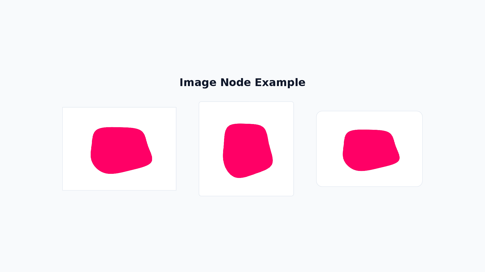

```xml
<Image src="https://placehold.co/200x150" w="200" h="150" />
```

| Attribute      | Values                                                                                          |
| -------------- | ----------------------------------------------------------------------------------------------- |
| `src`          | string (URL / path / base64)                                                                    |
| `sizing`       | `'{"type":"contain"}'` / `'{"type":"cover"}'` / `'{"type":"crop","x":0,"y":0,"w":100,"h":100}'` |
| `altText`      | string — accessible description read by screen readers                                          |
| `isDecorative` | `"true"` — marks the image as decorative; pptxgenjs sets altText to `""` for accessibility      |
| `rotate`       | number — rotation angle in degrees                                                              |

- If `w` and `h` are not specified, the actual image size is automatically used.
- If size is specified, the image is displayed at that size (aspect ratio is not preserved).
- Use `sizing` to control how the image fits within its bounds:
  - `contain`: Maintains aspect ratio, fits within the specified size
  - `cover`: Maintains aspect ratio, covers the entire specified size
  - `crop`: Crops the image to the specified region
- `isDecorative` takes precedence over `altText` when both are specified.

> **Security**: The builder does not validate `src` values for `<Image>` by default. The underlying pptxgenjs library reads non-HTTP paths via `fs.readFileSync` and HTTP(S) paths via `https.get`, enabling arbitrary file reads (`src="../../etc/passwd"`) and SSRF (`src="http://169.254.169.254/..."`) when callers accept untrusted input. **Validate `src` against an allowlist of safe paths/schemes before generating XML in server-side PPTX generation services**, or use the `imageSrcGuard` option to opt-in to runtime validation. `data:` URIs are processed in-memory and are safe.

### 5. Table

A node for drawing tables. Column widths and row heights are declared in px, with fine-grained control over cell decoration.

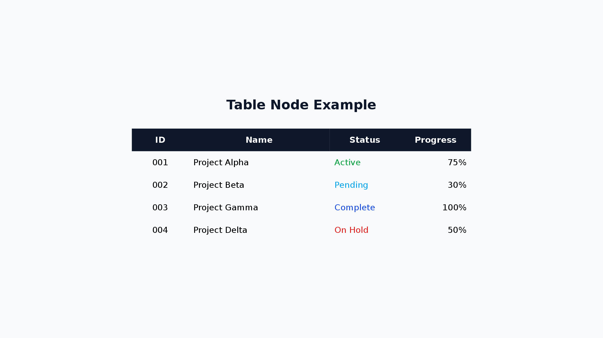

```xml
<Table>
  <Col w="200" />
  <Col w="100" />
  <Tr>
    <Td bold="true" backgroundColor="DBEAFE">Name</Td>
    <Td bold="true" backgroundColor="DBEAFE">Score</Td>
  </Tr>
  <Tr>
    <Td>Alice</Td>
    <Td>95</Td>
  </Tr>
</Table>
```

- `<Col>`: `w` (canonical — `width` is deprecated). Omit for even distribution.
- `<Tr>`: `h` (canonical — `height` is deprecated). Omit to apply `defaultRowHeight` (default 32).
- `<Td>`: Text content + `fontSize` `color` `bold` `italic` `underline` `strike` `highlight` `textAlign` `verticalAlign` (default: `middle`) `backgroundColor` `colspan` `rowspan` `margin`. Also supports `<B>`, `<I>`, `<A>`, `<U>`, `<S>`, `<Mark>`, and `<Span>` inline formatting

| Attribute          | Values                                                                                   |
| ------------------ | ---------------------------------------------------------------------------------------- |
| `defaultRowHeight` | number (default: 32)                                                                     |
| `cellBorder`       | `{color, width, dashType}` — cell border style                                           |
| `cellMargin`       | number (px) or `{top, right, bottom, left}` — default cell margin (default: `5/10/5/10`) |

### 6. Shape

A node for drawing shapes. Different representations are possible with or without text, supporting complex visual effects.

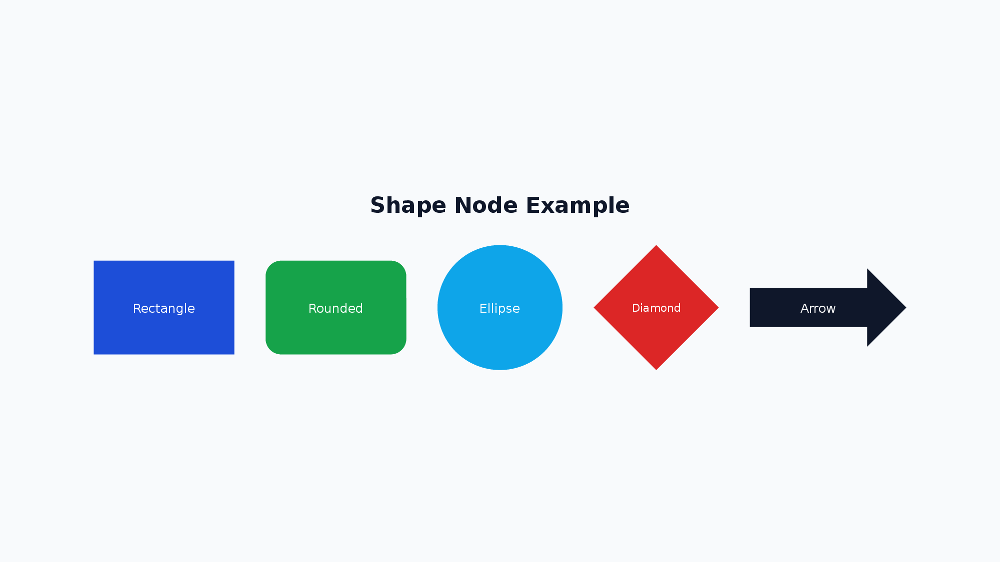

```xml
<Shape shapeType="roundRect" w="200" h="60" text="Button" fontSize="16" fill.color="1D4ED8" color="FFFFFF" />
```

| Attribute       | Values                                                                                                    |
| --------------- | --------------------------------------------------------------------------------------------------------- |
| `shapeType`     | Shape type (178 types — see list below)                                                                   |
| `text`          | string (text inside the shape)                                                                            |
| `fill`          | `fill.color="hex" fill.transparency="0.5"` — transparency is 0–1 (0 = opaque, 1 = fully transparent)      |
| `line`          | `line.color="hex" line.width="2" line.dashType="dash"`                                                    |
| `textVAlign`    | `"top"` / `"middle"` (default) / `"bottom"` — vertical alignment of text inside the shape                 |
| `rotate`        | number — rotation angle in degrees                                                                        |
| Text attributes | `fontSize` `color` `textAlign` `bold` `italic` `underline` `strike` `highlight` `fontFamily` `lineHeight` |

**Common Shape Types:**

- `roundRect`: Rounded rectangle (title boxes, category displays)
- `ellipse`: Ellipse/circle (step numbers, badges)
- `cloud`: Cloud shape (comments, key points)
- `wedgeRectCallout`: Callout with arrow (annotations)
- `cloudCallout`: Cloud callout (comments)
- `star5`: 5-pointed star (emphasis, decoration)
- `downArrow`: Down arrow (flow diagrams)

<details>
<summary>All Shape Types (178 types)</summary>

**Basic Shapes:**
`arc`, `bevel`, `blockArc`, `can`, `chord`, `corner`, `cube`, `decagon`, `diagStripe`, `diamond`, `dodecagon`, `donut`, `ellipse`, `folderCorner`, `frame`, `funnel`, `halfFrame`, `heptagon`, `hexagon`, `homePlate`, `nonIsoscelesTrapezoid`, `octagon`, `parallelogram`, `pentagon`, `pie`, `pieWedge`, `plaque`, `plus`, `rect`, `roundRect`, `rtTriangle`, `trapezoid`, `triangle`

**Rounded & Snipped Rectangles:**
`round1Rect`, `round2DiagRect`, `round2SameRect`, `snip1Rect`, `snip2DiagRect`, `snip2SameRect`, `snipRoundRect`

**Arrows:**
`bentArrow`, `bentUpArrow`, `chevron`, `circularArrow`, `curvedDownArrow`, `curvedLeftArrow`, `curvedRightArrow`, `curvedUpArrow`, `downArrow`, `leftArrow`, `leftCircularArrow`, `leftRightArrow`, `leftRightCircularArrow`, `leftRightUpArrow`, `leftUpArrow`, `notchedRightArrow`, `quadArrow`, `rightArrow`, `stripedRightArrow`, `swooshArrow`, `upArrow`, `upDownArrow`, `uturnArrow`

**Arrow Callouts:**
`downArrowCallout`, `leftArrowCallout`, `leftRightArrowCallout`, `quadArrowCallout`, `rightArrowCallout`, `upArrowCallout`, `upDownArrowCallout`

**Callouts:**
`accentBorderCallout1`, `accentBorderCallout2`, `accentBorderCallout3`, `accentCallout1`, `accentCallout2`, `accentCallout3`, `borderCallout1`, `borderCallout2`, `borderCallout3`, `callout1`, `callout2`, `callout3`, `cloudCallout`, `wedgeEllipseCallout`, `wedgeRectCallout`, `wedgeRoundRectCallout`

**Stars & Banners:**
`doubleWave`, `ellipseRibbon`, `ellipseRibbon2`, `horizontalScroll`, `irregularSeal1`, `irregularSeal2`, `leftRightRibbon`, `ribbon`, `ribbon2`, `star4`, `star5`, `star6`, `star7`, `star8`, `star10`, `star12`, `star16`, `star24`, `star32`, `verticalScroll`, `wave`

**Flowchart:**
`flowChartAlternateProcess`, `flowChartCollate`, `flowChartConnector`, `flowChartDecision`, `flowChartDelay`, `flowChartDisplay`, `flowChartDocument`, `flowChartExtract`, `flowChartInputOutput`, `flowChartInternalStorage`, `flowChartMagneticDisk`, `flowChartMagneticDrum`, `flowChartMagneticTape`, `flowChartManualInput`, `flowChartManualOperation`, `flowChartMerge`, `flowChartMultidocument`, `flowChartOfflineStorage`, `flowChartOffpageConnector`, `flowChartOnlineStorage`, `flowChartOr`, `flowChartPredefinedProcess`, `flowChartPreparation`, `flowChartProcess`, `flowChartPunchedCard`, `flowChartPunchedTape`, `flowChartSort`, `flowChartSummingJunction`, `flowChartTerminator`

**Action Buttons:**
`actionButtonBackPrevious`, `actionButtonBeginning`, `actionButtonBlank`, `actionButtonDocument`, `actionButtonEnd`, `actionButtonForwardNext`, `actionButtonHelp`, `actionButtonHome`, `actionButtonInformation`, `actionButtonMovie`, `actionButtonReturn`, `actionButtonSound`

**Brackets & Braces:**
`bracePair`, `bracketPair`, `leftBrace`, `leftBracket`, `rightBrace`, `rightBracket`

**Math Symbols:**
`mathDivide`, `mathEqual`, `mathMinus`, `mathMultiply`, `mathNotEqual`, `mathPlus`

**Others:**
`chartPlus`, `chartStar`, `chartX`, `cloud`, `cornerTabs`, `gear6`, `gear9`, `heart`, `lightningBolt`, `line`, `lineInv`, `moon`, `noSmoking`, `plaqueTabs`, `smileyFace`, `squareTabs`, `sun`, `teardrop`

</details>

#### Limitations

> **Limitation**: The `fill` style supports only solid color (`color`, `transparency`). Gradient and pattern fills are not supported.

> **Note**: `rotate` spins the entire shape element. Rotated shapes do not participate in Yoga layout after rotation — position and size are computed before rotation is applied.

> **Note**: `shapeType` values follow [pptxgenjs](https://gitbrent.github.io/PptxGenJS/) shape name conventions (version 4.x). If pptxgenjs is upgraded, shape names may need verification against the new pptxgenjs release.

### 7. VStack

Arranges child elements **vertically**.

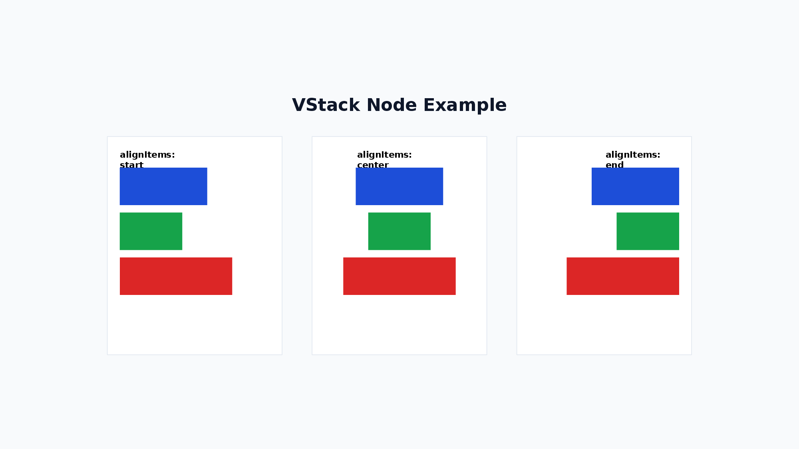

```xml
<VStack gap="16" alignItems="stretch" justifyContent="start">
  <Text>A</Text>
  <Text>B</Text>
</VStack>
```

| Attribute        | Values                                                                      |
| ---------------- | --------------------------------------------------------------------------- |
| `gap`            | number (gap between children)                                               |
| `alignItems`     | `start` / `center` / `end` / `stretch`                                      |
| `justifyContent` | `start` / `center` / `end` / `spaceBetween` / `spaceAround` / `spaceEvenly` |
| `flexWrap`       | `nowrap` / `wrap` / `wrapReverse`                                           |

> **Note:** Child elements of VStack have `flexShrink=1` by default (same as CSS Flexbox), so percentage-based heights combined with `gap` will shrink automatically to fit within the parent.

### 8. HStack

Arranges child elements **horizontally**.

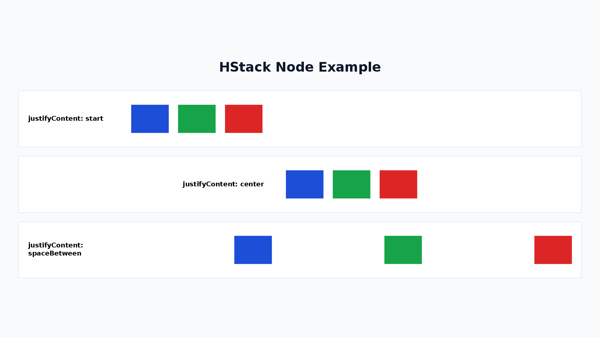

```xml
<HStack gap="16" alignItems="center" justifyContent="start">
  <Text>A</Text>
  <Text>B</Text>
</HStack>
```

| Attribute        | Values                                                                      |
| ---------------- | --------------------------------------------------------------------------- |
| `gap`            | number (gap between children)                                               |
| `alignItems`     | `start` / `center` / `end` / `stretch`                                      |
| `justifyContent` | `start` / `center` / `end` / `spaceBetween` / `spaceAround` / `spaceEvenly` |
| `flexWrap`       | `nowrap` / `wrap` / `wrapReverse`                                           |

> **Note:** Child elements of HStack have `flexShrink=1` by default (same as CSS Flexbox), so percentage-based widths combined with `gap` will shrink automatically to fit within the parent.

### 9. Chart

A node for drawing charts. Supports bar charts, line charts, pie charts, area charts, doughnut charts, and radar charts.

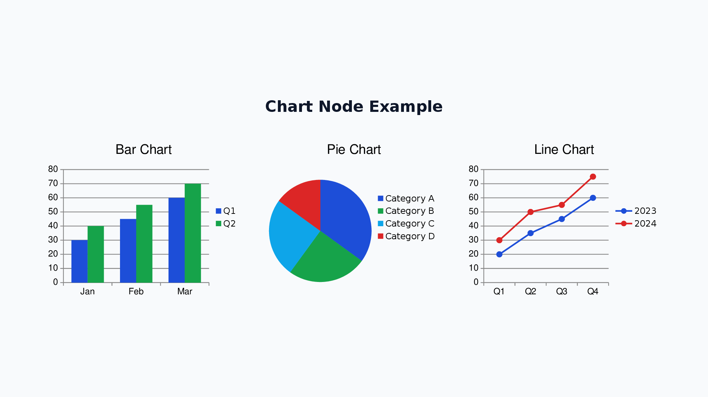

```xml
<Chart chartType="bar" w="500" h="300" showLegend="true" chartColors='["0088CC","00AA00"]'>
  <ChartSeries name="Sales">
    <ChartDataPoint label="Jan" value="100" />
    <ChartDataPoint label="Feb" value="150" />
  </ChartSeries>
</Chart>
```

| Attribute              | Values                                                                                           |
| ---------------------- | ------------------------------------------------------------------------------------------------ |
| `chartType`            | `bar` / `line` / `pie` / `area` / `doughnut` / `radar` (required)                                |
| `data`                 | JSON array `[{name?, labels[], values[]}]` — alternative to `<ChartSeries>` / `<ChartDataPoint>` |
| `showLegend`           | boolean                                                                                          |
| `showTitle`            | boolean                                                                                          |
| `title`                | string                                                                                           |
| `chartColors`          | JSON array `'["hex1","hex2"]'` — per-series palette                                              |
| `radarStyle`           | `standard` / `marker` / `filled` (radar only)                                                    |
| `legendPos`            | `t` / `b` / `l` / `r` / `tr` (default: `r`)                                                      |
| `legendFontSize`       | number in pt (default: `12`)                                                                     |
| `catAxisLabelFontSize` | number in pt — category axis label font size                                                     |
| `valAxisLabelFontSize` | number in pt — value axis label font size                                                        |
| `barGapWidthPct`       | number — gap between bars as a percentage of bar width (default: `100`, bar/area only)           |
| `lineDataSymbolSize`   | number — data-point marker size for line / radar charts                                          |
| `showValue`            | boolean — display data values on each bar/point                                                  |
| `barGrouping`          | `clustered` / `stacked` / `percentStacked` — bar grouping mode (bar/area only)                   |
| `valAxisMinVal`        | number — minimum value for the value axis                                                        |
| `valAxisMaxVal`        | number — maximum value for the value axis                                                        |
| `altText`              | string — accessible description read by screen readers                                           |

**Usage Examples:**

```xml
<!-- Bar chart -->
<Chart chartType="bar" w="600" h="400" showLegend="true" showTitle="true"
  title="Monthly Sales &amp; Profit" chartColors='["0088CC","00AA00"]'>
  <ChartSeries name="Sales">
    <ChartDataPoint label="Jan" value="100" />
    <ChartDataPoint label="Feb" value="200" />
    <ChartDataPoint label="Mar" value="150" />
    <ChartDataPoint label="Apr" value="300" />
  </ChartSeries>
  <ChartSeries name="Profit">
    <ChartDataPoint label="Jan" value="30" />
    <ChartDataPoint label="Feb" value="60" />
    <ChartDataPoint label="Mar" value="45" />
    <ChartDataPoint label="Apr" value="90" />
  </ChartSeries>
</Chart>

<!-- Pie chart -->
<Chart chartType="pie" w="400" h="300" showLegend="true"
  chartColors='["0088CC","00AA00","FF6600","888888"]'>
  <ChartSeries name="Market Share">
    <ChartDataPoint label="Product A" value="40" />
    <ChartDataPoint label="Product B" value="30" />
    <ChartDataPoint label="Product C" value="20" />
    <ChartDataPoint label="Others" value="10" />
  </ChartSeries>
</Chart>

<!-- Radar chart -->
<Chart chartType="radar" w="400" h="300" showLegend="true"
  radarStyle="filled" chartColors='["0088CC"]'>
  <ChartSeries name="Skill Assessment">
    <ChartDataPoint label="Technical" value="80" />
    <ChartDataPoint label="Design" value="60" />
    <ChartDataPoint label="PM" value="70" />
    <ChartDataPoint label="Sales" value="50" />
    <ChartDataPoint label="Support" value="90" />
  </ChartSeries>
</Chart>
```

#### Limitations

> **Limitation**: Mixed/combo chart types are not supported. A `<Chart>` renders a single chart type per node.

### 10. Line

A node for drawing lines and arrows. Uses absolute coordinates (x1, y1, x2, y2) for start and end points.

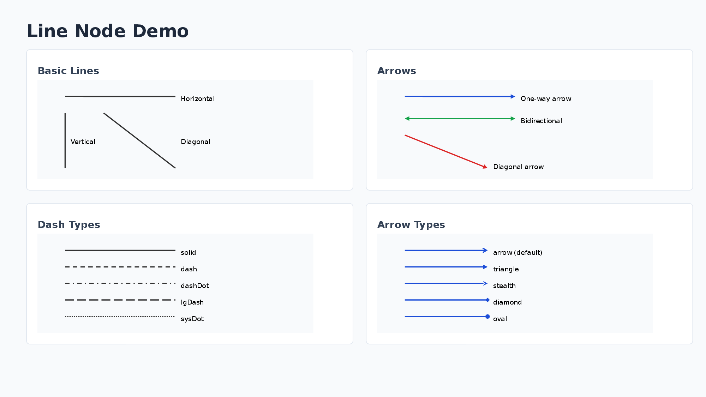

```xml
<Line x1="100" y1="100" x2="300" y2="100" color="333333" lineWidth="2" endArrow="true" />
```

| Attribute                 | Values                                                                               |
| ------------------------- | ------------------------------------------------------------------------------------ |
| `x1` `y1` `x2` `y2`       | number (absolute coordinates, required)                                              |
| `color`                   | hex (default: `000000`)                                                              |
| `lineWidth`               | number (default: 1)                                                                  |
| `dashType`                | `solid` / `dash` / `dashDot` / `lgDash` / `sysDash` etc.                             |
| `beginArrow` / `endArrow` | `true` / `endArrow.type="triangle"` (type: none/arrow/triangle/diamond/oval/stealth) |

Note: Line nodes use absolute coordinates on the slide and are not affected by Yoga layout calculations.

**Usage Examples:**

```xml
<!-- Simple horizontal line -->
<Line x1="100" y1="100" x2="300" y2="100" color="333333" lineWidth="2" />

<!-- Arrow pointing right -->
<Line x1="100" y1="150" x2="300" y2="150" color="333333" lineWidth="2" endArrow="true" />

<!-- Bidirectional arrow -->
<Line x1="100" y1="200" x2="300" y2="200" color="333333" lineWidth="2" beginArrow="true" endArrow="true" />

<!-- Diagonal line with arrow (bottom-right direction) -->
<Line x1="100" y1="100" x2="250" y2="200" color="1D4ED8" lineWidth="2" endArrow="true" />

<!-- Dashed line -->
<Line x1="100" y1="250" x2="300" y2="250" color="333333" lineWidth="2" dashType="dash" />

<!-- Custom arrow type (diamond) -->
<Line x1="100" y1="300" x2="300" y2="300" color="1D4ED8" lineWidth="2" endArrow.type="diamond" />
```

### 11. Layer

A container for absolute positioning of child elements. Child elements are positioned using `x` and `y` coordinates relative to the layer's top-left corner.

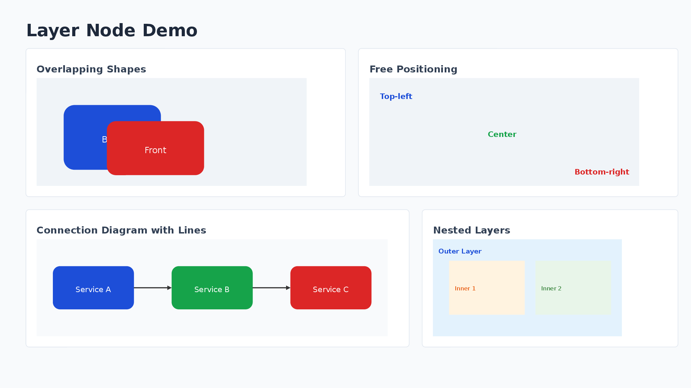

```xml
<Layer w="600" h="400">
  <Shape shapeType="roundRect" x="50" y="50" w="120" h="80" fill.color="1D4ED8" text="A" color="FFFFFF" />
  <Line x1="170" y1="90" x2="300" y2="90" endArrow="true" />
</Layer>
```

- Child elements can have `x` `y` attributes (relative to layer's top-left corner, defaults to `0`).
- Drawing order follows document order (later elements are drawn on top).
- Layer itself participates in Flexbox layout (can be placed in VStack/HStack).
- Layers can be nested.

**Usage Examples:**

```xml
<!-- Basic absolute positioning with overlapping shapes -->
<Layer w="600" h="400" backgroundColor="F0F4F8">
  <!-- Back shape (drawn first) -->
  <Shape shapeType="rect" x="50" y="50" w="120" h="100" fill.color="1D4ED8" text="Back" color="FFFFFF" />
  <!-- Front shape (drawn on top) -->
  <Shape shapeType="rect" x="100" y="80" w="120" h="100" fill.color="DC2626" text="Front" color="FFFFFF" />
</Layer>

<!-- Layer with VStack children for free-form layout -->
<Layer w="800" h="300" backgroundColor="F8FAFC">
  <VStack x="20" y="20" w="200" gap="8" padding="12" backgroundColor="FFFFFF">
    <Text fontSize="14" bold="true">Left Column</Text>
    <Text fontSize="12">Content A</Text>
  </VStack>
  <VStack x="300" y="20" w="200" gap="8" padding="12" backgroundColor="FFFFFF">
    <Text fontSize="14" bold="true">Right Column</Text>
    <Text fontSize="12">Content B</Text>
  </VStack>
</Layer>

<!-- Connection diagram with lines -->
<Layer w="800" h="200" backgroundColor="F8FAFC">
  <Shape shapeType="roundRect" x="50" y="60" w="150" h="80" fill.color="1D4ED8" text="Service A" color="FFFFFF" />
  <Shape shapeType="roundRect" x="350" y="60" w="150" h="80" fill.color="16A34A" text="Service B" color="FFFFFF" />
  <Line x1="200" y1="100" x2="350" y2="100" color="333333" lineWidth="2" endArrow="true" />
  <Text x="240" y="70" fontSize="10">API Call</Text>
</Layer>

<!-- Nested layers -->
<Layer w="600" h="150" backgroundColor="E3F2FD">
  <Text x="10" y="10" fontSize="12" bold="true">Outer Layer</Text>
  <Layer x="50" y="40" w="200" h="80" backgroundColor="FFF3E0">
    <Text x="10" y="30" fontSize="11">Inner Layer</Text>
  </Layer>
</Layer>
```

### 12. Icon

A node for displaying icons from the Lucide icon library. Icons are rendered as PNG images at the specified size and color.

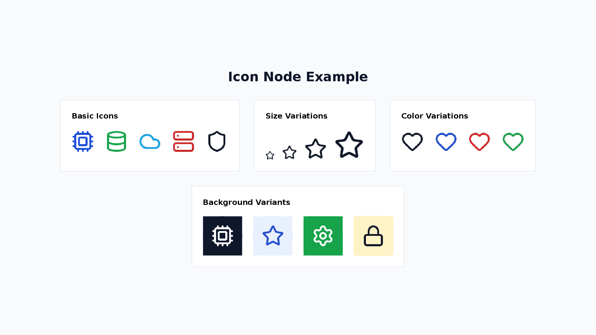

```xml
<Icon name="cpu" size="32" color="#1D4ED8" />
<Icon name="cpu" variant="circle-filled" backgroundColor="#E8F0FE" color="#1D4ED8" />
```

| Attribute         | Values                                                                                                                       |
| ----------------- | ---------------------------------------------------------------------------------------------------------------------------- |
| `name`            | icon name (required)                                                                                                         |
| `size`            | number (default: 24, in px)                                                                                                  |
| `color`           | hex color (default: `#000000`)                                                                                               |
| `variant`         | `circle-filled`, `circle-outlined`, `square-filled`, `square-outlined`                                                       |
| `backgroundColor` | hex color for the background shape (default: `#E0E0E0` when variant is set). `bgColor` is deprecated — use `backgroundColor` |
| `altText`         | string — accessible description read by screen readers (paired with `isDecorative` from common attrs)                        |

All [Lucide icons](https://lucide.dev/icons/) are available. Below are common examples:

**Common Icons (49):**

| Category      | Icons                                                                          |
| ------------- | ------------------------------------------------------------------------------ |
| Technology    | `cpu`, `database`, `cloud`, `server`, `code`, `terminal`, `wifi`, `globe`      |
| People        | `user`, `users`, `contact`                                                     |
| Business      | `briefcase`, `building`, `bar-chart`, `line-chart`, `pie-chart`, `trending-up` |
| Communication | `mail`, `message-square`, `phone`, `video`                                     |
| Action        | `search`, `settings`, `filter`, `download`, `upload`, `share`                  |
| Status        | `check`, `alert-triangle`, `info`, `shield`, `lock`, `unlock`                  |
| Content       | `file`, `folder`, `image`, `calendar`, `clock`, `bookmark`                     |
| Navigation    | `arrow-right`, `arrow-left`, `arrow-up`, `arrow-down`, `external-link`         |
| Other         | `star`, `heart`, `zap`, `target`, `lightbulb`                                  |

### 13. Svg

A node for rendering inline SVG graphics. SVGs are rasterized to PNG at the specified size.

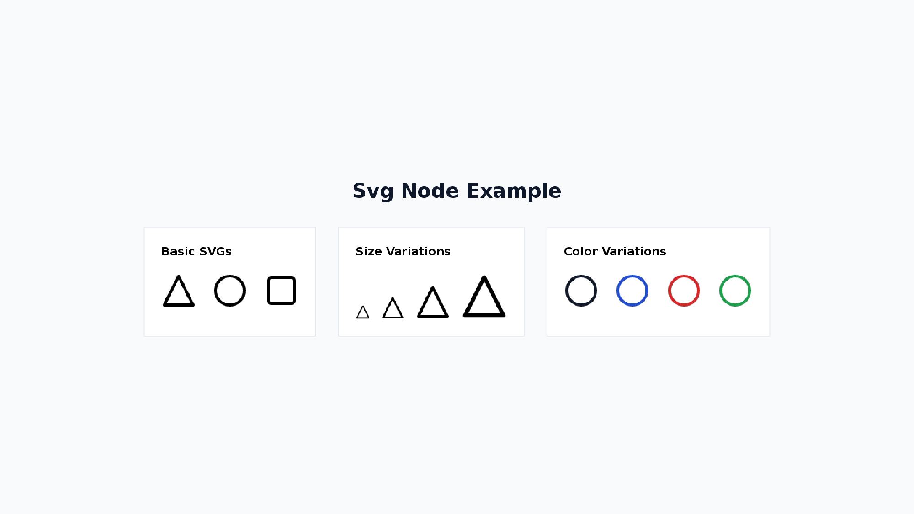

```xml
<Svg w="32" h="32" color="#1D4ED8">
  <svg viewBox="0 0 24 24">
    <path d="M12 2L2 22h20z" fill="none" stroke-width="2"/>
  </svg>
</Svg>
```

| Attribute | Values                                                                                 |
| --------- | -------------------------------------------------------------------------------------- |
| `w`       | number (default: 24, width in px)                                                      |
| `h`       | number (default: 24, height in px)                                                     |
| `color`   | hex color — recolours monochrome SVGs by injecting `stroke` / `fill="none"` on `<svg>` |
| `altText` | string — accessible description read by screen readers                                 |

A `<svg>` child element is required.

When `color` is specified, it sets `stroke` and `fill="none"` on the root `<svg>` element. If child elements within the SVG have explicit `stroke` or `fill` attributes, those take precedence over the root-level values.
